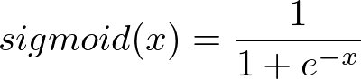
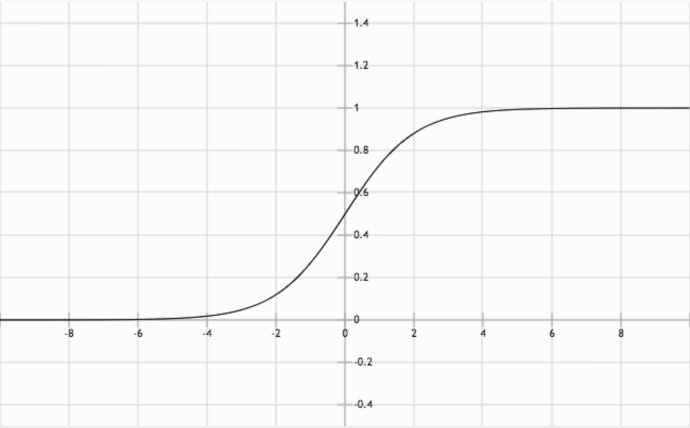
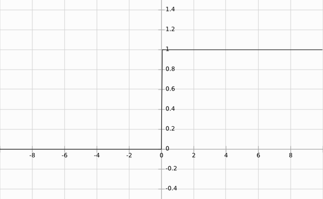

# Sigmoid Function



Equation(3)



Graph of the sigmoid function. Notice the "S" shape.

Linear transforms are great for simply shifting values, but neural networks often require a more nuanced transform. For instance, one of the original designs for an artificial neuron, the perceptron, exhibit binary output behavior. Perceptrons compare a weighted input to a threshold. When the weighted input exceeds the threshold, the perceptron is activated and outputs 1, otherwise it outputs 0.

You could model a perceptron's behavior as a step function.



Example of a step function (The jump between y = 0 and y = 1 should be instantaneous).

Activation, the idea of binary output behavior, generally makes sense for classification problems. For example, if you ask the network to hypothesize if a handwritten image is a '9', you're effectively asking for a binary output - yes, this is a '9', or no, this is not a '9'. A step function is the starkest form of a binary output, which is great, but step functions are not continuous and not differentiable, which is very bad. Differentiation is what makes gradient descent possible.

The sigmoid function, Equation (3) above, replaces thresholding with a beautiful S-shaped curve (also shown above) that mimics the activation behavior of a perceptron while maintaining continuity, and thus differentiability. As a bonus, the sigmoid function has a very simple derivative that looks remarkably similar to the sigmoid itself.


Equation (4). σ represents Equation (3)

Notice that the sigmoid function only has one parameter. Remember that sigmoid is an activation function (non-linearity), meaning it takes a single input and performs a mathematical operation on it.

Conceptually, the sigmoid function makes decisions. When given weighted features from some data, it indicates whether or not the features contribute to a classification. In that way, a sigmoid activation works well following a linear transformation. As it stands right now with random weights and bias, the sigmoid node's output is also random. The process of learning through back-propagation and gradient descent, which you will implement soon, modifies the weights and bias such that activation of the sigmoid node begins to match expected outputs.
Now that I've given you the equation for the sigmoid function, I want you to add it to the MiniFlow library. To do so, you'll want to use np.exp (documentation) to make your life much easier.

You'll be using Sigmoid in conjunction with Linear. Here's how it should look:


Inputs > Linear Transform > Sigmoid

***

### Code

nn.py:

```python
"""
This network feeds the output of a linear transform
to the sigmoid function.

Finish implementing the Sigmoid class in miniflow.py!

Feel free to play around with this network, too!
"""

import numpy as np
from miniflow import *

X, W, b = Input(), Input(), Input()

f = Linear(X, W, b)
g = Sigmoid(f)

X_ = np.array([[-1., -2.], [-1, -2]])
W_ = np.array([[2., -3], [2., -3]])
b_ = np.array([-3., -5])

feed_dict = {X: X_, W: W_, b: b_}

graph = topological_sort(feed_dict)
output = forward_pass(g, graph)

"""
Output should be:
[[  1.23394576e-04   9.82013790e-01]
 [  1.23394576e-04   9.82013790e-01]]
"""
print(output)
```

miniflow.py:

```python
"""
Fix the Sigmoid class so that it computes the sigmoid function
on the forward pass!

Scroll down to get started.
"""

import numpy as np

class Node(object):
    def __init__(self, inbound_nodes=[]):
        self.inbound_nodes = inbound_nodes
        self.value = None
        self.outbound_nodes = []
        for node in inbound_nodes:
            node.outbound_nodes.append(self)

    def forward():
        raise NotImplementedError


class Input(Node):
    def __init__(self):
        # An Input node has no inbound nodes,
        # so no need to pass anything to the Node instantiator
        Node.__init__(self)

    def forward(self):
        # Do nothing because nothing is calculated.
        pass


class Linear(Node):
    def __init__(self, X, W, b):
        # Notice the ordering of the input nodes passed to the
        # Node constructor.
        Node.__init__(self, [X, W, b])

    def forward(self):
        X = self.inbound_nodes[0].value
        W = self.inbound_nodes[1].value
        b = self.inbound_nodes[2].value
        self.value = np.dot(X, W) + b


class Sigmoid(Node):
    """
    You need to fix the `_sigmoid` and `forward` methods.
    """
    def __init__(self, node):
        Node.__init__(self, [node])

    def _sigmoid(self, x):
        """
        This method is separate from `forward` because it
        will be used later with `backward` as well.

        `x`: A numpy array-like object.

        Return the result of the sigmoid function.

        Your code here!
        """
        return 1. / (1. + np.exp(-x))


    def forward(self):
        """
        Set the value of this node to the result of the
        sigmoid function, `_sigmoid`.

        Your code here!
        """
        # This is a dummy value to prevent numpy errors
        # if you test without changing this method.
        
        input_value = self.inbound_nodes[0].value
        self.value = self._sigmoid(input_value)


def topological_sort(feed_dict):
    """
    Sort the nodes in topological order using Kahn's Algorithm.

    `feed_dict`: A dictionary where the key is a `Input` Node and the value is the respective value feed to that Node.

    Returns a list of sorted nodes.
    """

    input_nodes = [n for n in feed_dict.keys()]

    G = {}
    nodes = [n for n in input_nodes]
    while len(nodes) > 0:
        n = nodes.pop(0)
        if n not in G:
            G[n] = {'in': set(), 'out': set()}
        for m in n.outbound_nodes:
            if m not in G:
                G[m] = {'in': set(), 'out': set()}
            G[n]['out'].add(m)
            G[m]['in'].add(n)
            nodes.append(m)

    L = []
    S = set(input_nodes)
    while len(S) > 0:
        n = S.pop()

        if isinstance(n, Input):
            n.value = feed_dict[n]

        L.append(n)
        for m in n.outbound_nodes:
            G[n]['out'].remove(m)
            G[m]['in'].remove(n)
            # if no other incoming edges add to S
            if len(G[m]['in']) == 0:
                S.add(m)
    return L


def forward_pass(output_node, sorted_nodes):
    """
    Performs a forward pass through a list of sorted Nodes.

    Arguments:

        `output_node`: A Node in the graph, should be the output node (have no outgoing edges).
        `sorted_nodes`: a topologically sorted list of nodes.

    Returns the output node's value
    """

    for n in sorted_nodes:
        n.forward()

    return output_node.value

```

It may have seemed strange that _sigmoid was a separate method. As seen in the derivative of the sigmoid function, Equation (4), the sigmoid function is actually a part of its own derivative. Keeping _sigmoid separate means you won't have to implement it twice for forward and backward propagations.
