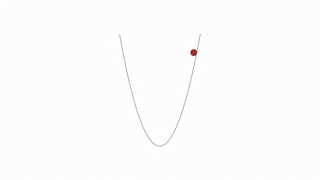

# Gradient Descent

### Backpropagation

Great! We've successfully calculated a full forward pass and found the cost. Next we need to start a backwards pass, which starts with back-propagation. Back-propagation is the process by which the network runs error values backwards.

During this process, the network calculates the way in which the weights need to change (also called the gradient) to reduce the overall error of the network. Changing the weights usually occurs through a technique called gradient descent.

Making sense of the purpose of back-propagation comes more easily after you work through the intended outcome. I'll come back to back-propagation in a bit, but first, I want to dive deeper into gradient descent.

***

### Gradient Descent


A point on a three dimension surface.

Imagine a point on a three dimensional surface. In real-life, a ball sitting on the slope of a valley makes a nice analogy. In this case, the height of the point represents the difference between the current output of the network and the correct output given the current parameter values (hence why you need data with known outputs). Each dimension of the plane represents another parameter to the network. A network with m parameters would be a hyperplane of m dimensions.

(Imagining more than three dimensions is tricky. The good news is that the ball and valley example describes the behavior of gradient descent well, the only difference between three dimensional and n dimensional situations being the number of parameters in the calculations.)

In the ideal situation, the ball rests at the bottom of the valley, indicating the minimum difference between the output of the network and the known correct output.

The learning process starts with random weights and biases. In the ball analogy, the ball starts at a random point near the valley.

Gradient descent works by first calculating the slope of the plane at the current point, which includes calculating the partial derivatives of the loss with respect to all of the parameters. This set of partial derivatives is called the **gradient**. Then it uses the gradient to modify the weights such that the next forward pass through the network moves the output lower in the hyperplane. Physically, this would be the same as measuring the slope of the valley at the location of the ball, and then moving the ball a small amount in the direction of the slope. Over time, it's possible to find the bottom of the valley with many small movements.


It moved a little bit

While gradient descent works remarkably well, the technique isn't guaranteed to find the absolute minimum difference between the network's output and the known output. Why?

It may get stuck in a local minimum while the absolute minimum may be "over the next hill" (in the ball analogy)

***

### Journey to the Bottom of the Valley

We know we'd like to move the ball to the bottom of the valley, but how do we accomplish this?

Intuitively, we want to push the ball downhill. And that makes sense, but when we're talking about our cost function, how do we know which way is downhill?

Luckily, the gradient provides this exact information.

Technically, the gradient actually points uphill, in the direction of **steepest ascent**. But if we put a - sign at the front this value, we get the direction of **steepest descent**, which is what we want.

You'll learn more about the gradient in a moment, but, for now, just think of it as a vector of numbers. Each number represents the amount by which we should adjust a corresponding weight or bias in the neural network. Adjusting all of the weights and biases by the gradient values reduces the cost (or error) of the network.

Got all that?

Great! Now we know where to push the ball. The next thing to consider is how much force should be applied to the push. This is known as the learning rate, which is an apt name since this value determines how quickly or slowly the neural network learns.

You might be tempted to set a really big learning rate, so the network learns really fast, right?

Be careful! If the value is too large you could overshoot the target and eventually diverge. Yikes!


**Convergence**. This is the ideal behavior.



**Divergence**. This can happen when the learning rate is too large.

So what is a good learning rate, then?

This is more of a guessing game than anything else but empirically values in the range 0.1 to 0.0001 work well. The range 0.001 to 0.0001 is popular, as 0.1 and 0.01 are sometimes too large.

Here's the formula for gradient descent (pseudocode):

```
x = x - learning_rate * gradient_of_x
x is a parameter used by the neural network (i.e. a single weight or bias).
```

We multiply gradient_of_x (the uphill direction) by learning_rate (the force of the push) and then subtract that from x to make the push go downhill.

***

Code:

f.py:

```python
"""
Given the starting point of any `x` gradient descent
should be able to find the minimum value of x for the
cost function `f` defined below.
"""
import random
from gd import gradient_descent_update


def f(x):
    """
    Quadratic function.

    It's easy to see the minimum value of the function
    is 5 when is x=0.
    """
    return x**2 + 5


def df(x):
    """
    Derivative of `f` with respect to `x`.
    """
    return 2*x


# Random number better 0 and 10,000. Feel free to set x whatever you like.
x = random.randint(0, 10000)
# TODO: Set the learning rate
learning_rate = 0.01
epochs = 100

for i in range(epochs+1):
    cost = f(x)
    gradx = df(x)
    print("EPOCH {}: Cost = {:.3f}, x = {:.3f}".format(i, cost, gradx))
    x = gradient_descent_update(x, gradx, learning_rate)

```

gd.py:

```python
def gradient_descent_update(x, gradx, learning_rate):
    """
    Performs a gradient descent update.
    """
    x = x - learning_rate * gradx
    # Return the new value for x
    return x
```

We adjust the old x pushing it in the direction of gradx with the force learning_rate. Subtracting learning_rate * gradx. Remember the gradient is initially in the direction of **steepest ascent** so subtracting learning_rate * gradx from x turns it into **steepest descent**. You can make sure of this yourself by replacing the subtraction with an addition.
