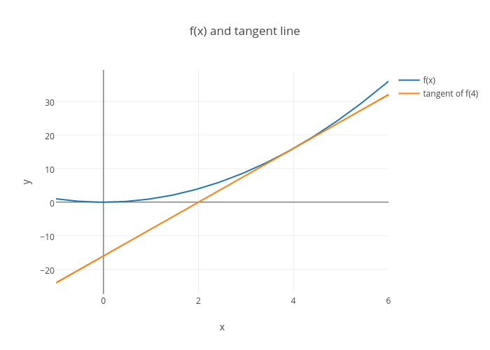

# Back-Propagation

As promised, we'll now discuss the gradient in more depth. Specifically we'll focus on the following insight:

>In order to figure out how we should alter a parameter to minimize the cost, we must first find out what effect that parameter has on the cost.

That makes sense. After all, we can't just blindly change parameter values and hope to get meaningful results. The gradient takes into account the effect each parameter has on the cost, so that's how we find the direction of steepest ascent.

How do we determine the effect a parameter has on the cost? This technique is famously known as **back-propagation** or **reverse-mode differentiation**. Those names might sound intimidating, but behind it all, it's just a clever application of the **chain rule**. Before we get into the chain rule let's revisit plain old derivatives.

***

### Derivatives

In calculus, the derivative tells us how something changes with respect to something else. Or, put differently, how sensitive something is to something else.

Let's take the function f(x)=x
​2
​​  as an example. In this case, the derivative of f(x) is 2x. Another way to state this is, "the derivative of f(x) with respect to x is 2x".

Using the derivative, we can say how much a change in x effects f(x). For example, when x is 4, the derivative is 8 (2x=2∗4=8). This means that if x is increased or decreased by 1 unit, then f(x) will increase or decrease by 8.



f(x) and the tangent line of f(x) when x = 4.

Notice that f(4)=16 and f(5)=25. 25 - 16 = 9, which isn't the same as 8.

But we just calculated that increasing x by 1 unit would change f(x) by 8. What happened?

The answer is that the slope (or derivative) itself changes as x changes. If we calculate the derivative when x is 4.5, it's now 9, which matches the difference between f(4)=16 and f(5)=25.

***

### Chain Rule

Let's return to neural networks and the original goal of figuring out what effect a parameter has on the cost.

We simply calculate the derivative of the cost with respect to each parameter in the network. The gradient is a vector of all these derivatives.

In reality, neural networks are a composition of functions, so computing the derivative of the cost w.r.t a parameter isn't quite as straightforward as calculating the derivative of a polynomial function like f(x)=x
​2
​​ . This is where the chain rule comes into play.

I highly recommend checking out Khan Academy's lessons on partial derivatives and gradients if you need more of a refresher.

Say we have a new function f(g(x)). We can calculate the derivative of f w.r.t x (∂x/​∂f) by applying the chain rule.

​∂x/​∂f = ∂x/​∂g * ​∂g/​∂f

The way to think about this is:

>In order to know the effect x has on f, we first need to know the effect x has on g, and then the effect g has on f.

Let's now look at a more complex example. Consider the following neural network in MiniFlow:

```python
X, y = Input(), Input()
W1, b1 = Input(), Input()
W2, b2 = Input(), Input()

l1 = Linear(X, W1, b1)
s1 = Sigmoid(l1)
l2 = Linear(s1, W2, b2)
cost = MSE(l2, y)
```

This also can be written as a composition of functions MSE(Linear(Sigmoid(Linear(X, W1, b1)), W2, b2), y). Our goal is to adjust the weights and biases represented by the Input nodes W1, b1, W2, b2, such that the cost is minimized.


Graph of the above neural network. The backward pass and gradients flowing through are illustrated.
In the upcoming quiz you'll implement the backward method for the Sigmoid node, so let's focus on that.

First, we unwrap the derivative of cost w.r.t. l1 (the input to the Sigmoid node). Once again, apply the chain rule:

​​∂cost/∂l1​​ = ​​∂s1/∂l1 * ​∂cost/​∂s1
​​
We can unwrap ∂cost/∂s1 further:

​∂cost/∂s1 = ∂l2/∂s1*∂cost/∂l2

Finally:

​∂cost/∂l1 = ∂s1/∂l1*∂l2/∂s1*∂cost/∂l2

In order to calculate the derivative of cost w.r.t l1 we need to figure out these 3 values:

​- ∂s1/∂l1
​​ 
​- ∂l2/∂s1

- ​∂cost/∂l2
​
Back-propagation makes computing these values convenient.

During back-propagation, the derivatives of nodes in the graph are computed back to front. In the case of the 3 above values, ∂cost/∂l2 would be computed first, followed by ∂l2/∂s1 and ∂s1/∂l1. Thus, if we compute ∂s1/∂l1, then we can also assume the 2 other values have already been computed!

This insight makes back-propagation much easier to implement. When computing the backward pass for a Node we only need to concern ourselves with the computation of that node w.r.t its inputs.

NOTE: As a quick aside, you might be wondering why we're even computing the derivative of cost w.r.t l1. After all, l1 is not a parameter of the neural network. While that is true, W1 and b1 are parameters of the network, and if you write the expression for cost w.r.t W1 or b1, you'll notice that the derivative of s1 w.r.t l1 is a term in that expression, and so for the chain rule, we'll need to calculate the derivative of cost w.r.t l1 at some point.

#### Additional Resources

Yes you should understand backprop by Andrej Karpathy
Vector, Matrix, and Tensor Derivatives by Erik Learned-Miller.

***

### New Code

There have been a couple of changes to MiniFlow since we last took it for a spin:

The first being the Node class now has a backward method, as well as a new attribute self.gradients, which is used to store and cache gradients during the backward pass.

```python
class Node(object):
    """
    Base class for nodes in the network.

    Arguments:

        `inbound_nodes`: A list of nodes with edges into this node.
    """
    def __init__(self, inbound_nodes=[]):
        """
        Node's constructor (runs when the object is instantiated). Sets
        properties that all nodes need.
        """
        # A list of nodes with edges into this node.
        self.inbound_nodes = inbound_nodes
        # The eventual value of this node. Set by running
        # the forward() method.
        self.value = None
        # A list of nodes that this node outputs to.
        self.outbound_nodes = []
        # New property! Keys are the inputs to this node and
        # their values are the partials of this node with
        # respect to that input.
        self.gradients = {}
        # Sets this node as an outbound node for all of
        # this node's inputs.
        for node in inbound_nodes:
            node.outbound_nodes.append(self)

    def forward(self):
        """
        Every node that uses this class as a base class will
        need to define its own `forward` method.
        """
        raise NotImplementedError

    def backward(self):
        """
        Every node that uses this class as a base class will
        need to define its own `backward` method.
        """
        raise NotImplementedError
```

The second change is to the helper function forward_pass(). That function has been replaced with forward_and_backward().

```python
def forward_and_backward(graph):
    """
    Performs a forward pass and a backward pass through a list of sorted nodes.

    Arguments:

        `graph`: The result of calling `topological_sort`.
    """
    # Forward pass
    for n in graph:
        n.forward()

    # Backward pass
    # see: https://docs.python.org/2.3/whatsnew/section-slices.html
    for n in graph[::-1]:
        n.backward()
```

#### Setup

Here's the derivative of the sigmoid function w.r.t x:

sigmoid(x)=1/(1+exp(−x))

​∂sigmoid/∂x = sigmoid(x)∗(1−sigmoid(x))

- Complete the implementation of back-propagation for the Sigmoid node by finishing the backward method in miniflow.py.
- The backward methods for all other nodes have already been implemented. Taking a look at them might be helpful.

### Code:

nn.py:

```python
"""
Test your network here!

No need to change this code, but feel free to tweak it
to test your network!

Make your changes to backward method of the Sigmoid class in miniflow.py
"""

import numpy as np
from miniflow import *

X, W, b = Input(), Input(), Input()
y = Input()
f = Linear(X, W, b)
a = Sigmoid(f)
cost = MSE(y, a)

X_ = np.array([[-1., -2.], [-1, -2]])
W_ = np.array([[2.], [3.]])
b_ = np.array([-3.])
y_ = np.array([1, 2])

feed_dict = {
    X: X_,
    y: y_,
    W: W_,
    b: b_,
}

graph = topological_sort(feed_dict)
forward_and_backward(graph)
# return the gradients for each Input
gradients = [t.gradients[t] for t in [X, y, W, b]]

"""
Expected output

[array([[ -3.34017280e-05,  -5.01025919e-05],
       [ -6.68040138e-05,  -1.00206021e-04]]), array([[ 0.9999833],
       [ 1.9999833]]), array([[  5.01028709e-05],
       [  1.00205742e-04]]), array([ -5.01028709e-05])]
"""
print(gradients)

```

miniflow.py:

```python
"""
Implement the backward method of the Sigmoid node.
"""
import numpy as np


class Node(object):
    """
    Base class for nodes in the network.

    Arguments:

        `inbound_nodes`: A list of nodes with edges into this node.
    """
    def __init__(self, inbound_nodes=[]):
        """
        Node's constructor (runs when the object is instantiated). Sets
        properties that all nodes need.
        """
        # A list of nodes with edges into this node.
        self.inbound_nodes = inbound_nodes
        # The eventual value of this node. Set by running
        # the forward() method.
        self.value = None
        # A list of nodes that this node outputs to.
        self.outbound_nodes = []
        # New property! Keys are the inputs to this node and
        # their values are the partials of this node with
        # respect to that input.
        self.gradients = {}
        # Sets this node as an outbound node for all of
        # this node's inputs.
        for node in inbound_nodes:
            node.outbound_nodes.append(self)

    def forward(self):
        """
        Every node that uses this class as a base class will
        need to define its own `forward` method.
        """
        raise NotImplementedError

    def backward(self):
        """
        Every node that uses this class as a base class will
        need to define its own `backward` method.
        """
        raise NotImplementedError


class Input(Node):
    """
    A generic input into the network.
    """
    def __init__(self):
        # The base class constructor has to run to set all
        # the properties here.
        #
        # The most important property on an Input is value.
        # self.value is set during `topological_sort` later.
        Node.__init__(self)

    def forward(self):
        # Do nothing because nothing is calculated.
        pass

    def backward(self):
        # An Input node has no inputs so the gradient (derivative)
        # is zero.
        # The key, `self`, is reference to this object.
        self.gradients = {self: 0}
        # Weights and bias may be inputs, so you need to sum
        # the gradient from output gradients.
        for n in self.outbound_nodes:
            grad_cost = n.gradients[self]
            self.gradients[self] += grad_cost * 1


class Linear(Node):
    """
    Represents a node that performs a linear transform.
    """
    def __init__(self, X, W, b):
        # The base class (Node) constructor. Weights and bias
        # are treated like inbound nodes.
        Node.__init__(self, [X, W, b])

    def forward(self):
        """
        Performs the math behind a linear transform.
        """
        X = self.inbound_nodes[0].value
        W = self.inbound_nodes[1].value
        b = self.inbound_nodes[2].value
        self.value = np.dot(X, W) + b

    def backward(self):
        """
        Calculates the gradient based on the output values.
        """
        # Initialize a partial for each of the inbound_nodes.
        self.gradients = {n: np.zeros_like(n.value) for n in self.inbound_nodes}
        # Cycle through the outputs. The gradient will change depending
        # on each output, so the gradients are summed over all outputs.
        for n in self.outbound_nodes:
            # Get the partial of the cost with respect to this node.
            grad_cost = n.gradients[self]
            # Set the partial of the loss with respect to this node's inputs.
            self.gradients[self.inbound_nodes[0]] += np.dot(grad_cost, self.inbound_nodes[1].value.T)
            # Set the partial of the loss with respect to this node's weights.
            self.gradients[self.inbound_nodes[1]] += np.dot(self.inbound_nodes[0].value.T, grad_cost)
            # Set the partial of the loss with respect to this node's bias.
            self.gradients[self.inbound_nodes[2]] += np.sum(grad_cost, axis=0, keepdims=False)


class Sigmoid(Node):
    """
    Represents a node that performs the sigmoid activation function.
    """
    def __init__(self, node):
        # The base class constructor.
        Node.__init__(self, [node])

    def _sigmoid(self, x):
        """
        This method is separate from `forward` because it
        will be used with `backward` as well.

        `x`: A numpy array-like object.
        """
        return 1. / (1. + np.exp(-x))

    def forward(self):
        """
        Perform the sigmoid function and set the value.
        """
        input_value = self.inbound_nodes[0].value
        self.value = self._sigmoid(input_value)

    def backward(self):
        """
        Calculates the gradient using the derivative of
        the sigmoid function.
        """
        # Initialize the gradients to 0.
        self.gradients = {n: np.zeros_like(n.value) for n in self.inbound_nodes}

        # Cycle through the outputs. The gradient will change depending
        # on each output, so the gradients are summed over all outputs.
        for n in self.outbound_nodes:
            # Get the partial of the cost with respect to this node.
            grad_cost = n.gradients[self]
            """
            TODO: Your code goes here!

            Set the gradients property to the gradients with respect to each input.

            NOTE: See the Linear node and MSE node for examples.
            """
            sigmoid = self.value
            self.gradients[self.inbound_nodes[0]] += sigmoid * (1 - sigmoid) * grad_cost


class MSE(Node):
    def __init__(self, y, a):
        """
        The mean squared error cost function.
        Should be used as the last node for a network.
        """
        # Call the base class' constructor.
        Node.__init__(self, [y, a])

    def forward(self):
        """
        Calculates the mean squared error.
        """
        # NOTE: We reshape these to avoid possible matrix/vector broadcast
        # errors.
        #
        # For example, if we subtract an array of shape (3,) from an array of shape
        # (3,1) we get an array of shape(3,3) as the result when we want
        # an array of shape (3,1) instead.
        #
        # Making both arrays (3,1) insures the result is (3,1) and does
        # an elementwise subtraction as expected.
        y = self.inbound_nodes[0].value.reshape(-1, 1)
        a = self.inbound_nodes[1].value.reshape(-1, 1)

        self.m = self.inbound_nodes[0].value.shape[0]
        # Save the computed output for backward.
        self.diff = y - a
        self.value = np.mean(self.diff**2)

    def backward(self):
        """
        Calculates the gradient of the cost.

        This is the final node of the network so outbound nodes
        are not a concern.
        """
        self.gradients[self.inbound_nodes[0]] = (2 / self.m) * self.diff
        self.gradients[self.inbound_nodes[1]] = (-2 / self.m) * self.diff


def topological_sort(feed_dict):
    """
    Sort the nodes in topological order using Kahn's Algorithm.

    `feed_dict`: A dictionary where the key is a `Input` Node and the value is the respective value feed to that Node.

    Returns a list of sorted nodes.
    """

    input_nodes = [n for n in feed_dict.keys()]

    G = {}
    nodes = [n for n in input_nodes]
    while len(nodes) > 0:
        n = nodes.pop(0)
        if n not in G:
            G[n] = {'in': set(), 'out': set()}
        for m in n.outbound_nodes:
            if m not in G:
                G[m] = {'in': set(), 'out': set()}
            G[n]['out'].add(m)
            G[m]['in'].add(n)
            nodes.append(m)

    L = []
    S = set(input_nodes)
    while len(S) > 0:
        n = S.pop()

        if isinstance(n, Input):
            n.value = feed_dict[n]

        L.append(n)
        for m in n.outbound_nodes:
            G[n]['out'].remove(m)
            G[m]['in'].remove(n)
            # if no other incoming edges add to S
            if len(G[m]['in']) == 0:
                S.add(m)
    return L


def forward_and_backward(graph):
    """
    Performs a forward pass and a backward pass through a list of sorted Nodes.

    Arguments:

        `graph`: The result of calling `topological_sort`.
    """
    # Forward pass
    for n in graph:
        n.forward()

    # Backward pass
    # see: https://docs.python.org/2.3/whatsnew/section-slices.html
    for n in graph[::-1]:
        n.backward()

```

The backward method sums the derivative (it's a normal derivative when there's only one variable) with respect to the only input over all the output nodes. The last line implements the derivative, ∂sigmoid/∂x * ∂cost/∂sigmoid.

Replacing the math expression with code:

​∂sigmoid/∂x is sigmoid * (1 - sigmoid) and ∂cost/∂sigmoid is grad_cost.

Now that you have the gradient of the cost with respect to each input (the return value from forward_and_backward()) your network can start learning! To do so, you will implement a technique called **Stochastic Gradient Descent**.
