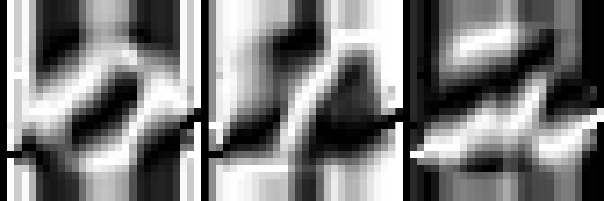

# TensorFlow Linear Function

Let’s derive the function y = Wx + b. We want to translate our input, x, to labels, y.

For example, imagine we want to classify images as digits.

x would be our list of pixel values, and y would be the logits, one for each digit. Let's take a look at y = Wx, where the weights, W, determine the influence of x at predicting each y.


Function y = Wx

y = Wx allows us to segment the data into their respective labels using a line.

However, this line has to pass through the origin, because whenever x equals 0, then y is also going to equal 0.

We want the ability to shift the line away from the origin to fit more complex data. The simplest solution is to add a number to the function, which we call “bias”.


Function y = Wx + b

Our new function becomes Wx + b, allowing us to create predictions on linearly separable data. Let’s use a concrete example and calculate the logits.

***

### Matrix Multiplication Quiz

Calculate the logits a and b for the following formula.


y = Wx + b

> a = 0.16

> b = 0.06

***

### Transposition

We've been using the y = Wx + b function for our linear function.

But there's another function that does the same thing, y = xW + b. These functions do the same thing and are interchangeable, except for the dimensions of the matrices involved.

To shift from one function to the other, you simply have to swap the row and column dimensions of each matrix. This is called transposition.

For rest of this lesson, we actually use xW + b, because this is what TensorFlow uses.


The above example is identical to the quiz you just completed, except that the matrices are transposed.

x now has the dimensions 1x3, W now has the dimensions 3x2, and b now has the dimensions 1x2. Calculating this will produce a matrix with the dimension of 1x2.

You'll notice that the elements in this 1x2 matrix are the same as the elements in the 2x1 matrix from the quiz. Again, these matrices are simply transposed.


We now have our logits! The columns represent the logits for our two labels.

Now you can learn how to train this function in TensorFlow.

***

### Weights and Bias in TensorFlow

The goal of training a neural network is to modify weights and biases to best predict the labels. In order to use weights and bias, you'll need a Tensor that can be modified. This leaves out tf.placeholder() and tf.constant(), since those Tensors can't be modified. This is where tf.Variable class comes in.

##### tf.Variable()


```python
x = tf.Variable(5)
```

The tf.Variable class creates a tensor with an initial value that can be modified, much like a normal Python variable. This tensor stores its state in the session, so you must initialize the state of the tensor manually. You'll use the tf.global_variables_initializer() function to initialize the state of all the Variable tensors.

##### Initialization

```python
init = tf.global_variables_initializer()
with tf.Session() as sess:
    sess.run(init)
```

The tf.global_variables_initializer() call returns an operation that will initialize all TensorFlow variables from the graph. You call the operation using a session to initialize all the variables as shown above. Using the tf.Variable class allows us to change the weights and bias, but an initial value needs to be chosen.

Initializing the weights with random numbers from a normal distribution is good practice. Randomizing the weights helps the model from becoming stuck in the same place every time you train it. You'll learn more about this in the next lesson, when you study gradient descent.

Similarly, choosing weights from a normal distribution prevents any one weight from overwhelming other weights. You'll use the tf.truncated_normal() function to generate random numbers from a normal distribution.

#### tf.truncated_normal()

```python
n_features = 120
n_labels = 5
weights = tf.Variable(tf.truncated_normal((n_features, n_labels)))
```

The tf.truncated_normal() function returns a tensor with random values from a normal distribution whose magnitude is no more than 2 standard deviations from the mean.

Since the weights are already helping prevent the model from getting stuck, you don't need to randomize the bias. Let's use the simplest solution, setting the bias to 0.

#### tf.zeros()

```python
n_labels = 5
bias = tf.Variable(tf.zeros(n_labels))
```

The tf.zeros() function returns a tensor with all zeros.

***

### Linear Classifier Quiz


Subset of MNIST dataset.

You'll be classifying the handwritten numbers 0, 1, and 2 from the MNIST dataset using TensorFlow. The above is a small sample of the data you'll be training on. Notice how some of the 1s are written with a serif at the top and at different angles. The similarities and differences will play a part in shaping the weights of the model.



Left: Weights for labeling 0. Middle: Weights for labeling 1. Right: Weights for labeling 2.

The images above are trained weights for each label (0, 1, and 2). The weights display the unique properties of each digit they have found. Complete this quiz to train your own weights using the MNIST dataset.

***

### Instructions

Open quiz.py.

- Implement get_weights to return a tf.Variable of weights
- Implement get_biases to return a tf.Variable of biases
- Implement xW + b in the linear function

Open sandbox.py

- Initialize all weights

Since xW in xW + b is matrix multiplication, you have to use the tf.matmul() function instead of tf.multiply(). Don't forget that order matters in matrix multiplication, so tf.matmul(a,b) is not the same as tf.matmul(b,a).

-

sandbox.py:

```python
# Solution is available in the other "sandbox_solution.py" tab
import tensorflow as tf
from tensorflow.examples.tutorials.mnist import input_data
from quiz import get_weights, get_biases, linear


def mnist_features_labels(n_labels):
    """
    Gets the first <n> labels from the MNIST dataset
    :param n_labels: Number of labels to use
    :return: Tuple of feature list and label list
    """
    mnist_features = []
    mnist_labels = []

    mnist = input_data.read_data_sets('/datasets/ud730/mnist', one_hot=True)

    # In order to make quizzes run faster, we're only looking at 10000 images
    for mnist_feature, mnist_label in zip(*mnist.train.next_batch(10000)):

        # Add features and labels if it's for the first <n>th labels
        if mnist_label[:n_labels].any():
            mnist_features.append(mnist_feature)
            mnist_labels.append(mnist_label[:n_labels])

    return mnist_features, mnist_labels


# Number of features (28*28 image is 784 features)
n_features = 784
# Number of labels
n_labels = 3

# Features and Labels
features = tf.placeholder(tf.float32)
labels = tf.placeholder(tf.float32)

# Weights and Biases
w = get_weights(n_features, n_labels)
b = get_biases(n_labels)

# Linear Function xW + b
logits = linear(features, w, b)

# Training data
train_features, train_labels = mnist_features_labels(n_labels)

with tf.Session() as session:
    # TODO: Initialize session variables
    session.run(tf.global_variables_initializer())
    
    # Softmax
    prediction = tf.nn.softmax(logits)

    # Cross entropy
    # This quantifies how far off the predictions were.
    # You'll learn more about this in future lessons.
    cross_entropy = -tf.reduce_sum(labels * tf.log(prediction), reduction_indices=1)

    # Training loss
    # You'll learn more about this in future lessons.
    loss = tf.reduce_mean(cross_entropy)

    # Rate at which the weights are changed
    # You'll learn more about this in future lessons.
    learning_rate = 0.08

    # Gradient Descent
    # This is the method used to train the model
    # You'll learn more about this in future lessons.
    optimizer = tf.train.GradientDescentOptimizer(learning_rate).minimize(loss)

    # Run optimizer and get loss
    _, l = session.run(
        [optimizer, loss],
        feed_dict={features: train_features, labels: train_labels})

# Print loss
print('Loss: {}'.format(l))

```

quiz.py:

```python
# Solution is available in the other "quiz_solution.py" tab
import tensorflow as tf

def get_weights(n_features, n_labels):
    """
    Return TensorFlow weights
    :param n_features: Number of features
    :param n_labels: Number of labels
    :return: TensorFlow weights
    """
    # TODO: Return weights
    return tf.Variable(tf.truncated_normal((n_features, n_labels)))


def get_biases(n_labels):
    """
    Return TensorFlow bias
    :param n_labels: Number of labels
    :return: TensorFlow bias
    """
    # TODO: Return biases
    return tf.Variable(tf.zeros(n_labels))


def linear(input, w, b):
    """
    Return linear function in TensorFlow
    :param input: TensorFlow input
    :param w: TensorFlow weights
    :param b: TensorFlow biases
    :return: TensorFlow linear function
    """
    # TODO: Linear Function (xW + b)
    return tf.add(tf.matmul(input, w), b)
```
