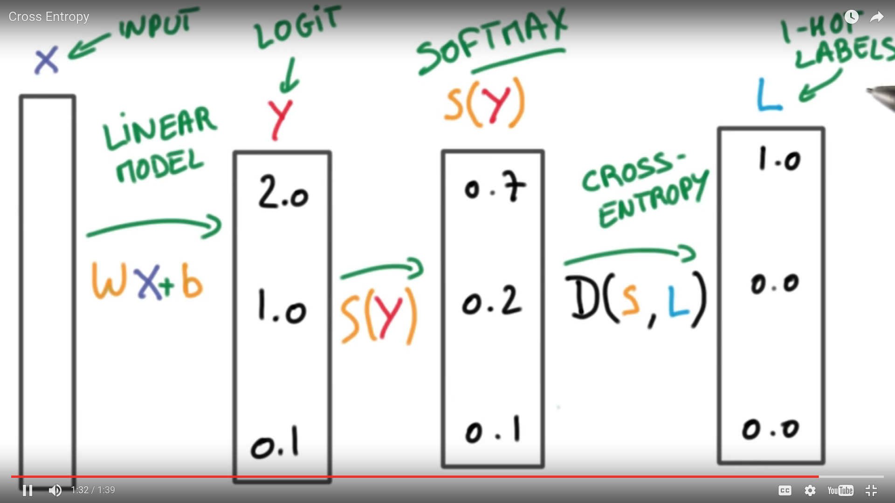

# Tying It All Together - Multinomial Logistic Classification

1. We have an *input* (X) that is going to be turned into *logits* (y) using a **linear model**, which is basically your matrix multiply and a bias (Weights*X*+bias)

2. Then we feed the *logits* (y) - which are scores - into a *softmax* (S(y)) which will turn them into *probabilities*

3. Then we will compare those probabilities to the one-ht encoded labels using the cross entropy function (D(S,L))

