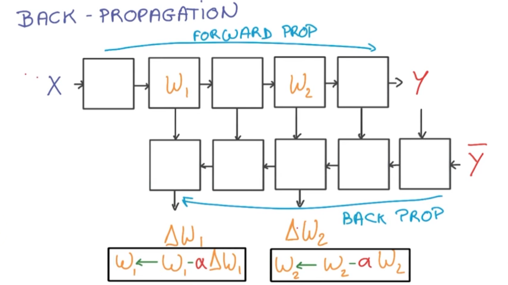

# Back Propagation

The forward propagation consists of a stack of simple operations that your input data will go through resulting in your predications **y**

To compute the derivatives, you create another graph where data flows backwards through the network, then gets combined using the chain rule that produces the gradients as seen in the lower half of the picture above (Delta(w1 and Delta(w2)) are the output gradients). This is called **Back Propagation** and it makes computing derivatives of complex functions very efficient as long as the function is made up of simple blocks with simple derivatives.

Running the model up to the predictions is called **Forward Propagation**, and running the model backwards is called **Backwards Propagation**.

***

### Summary

To run Stochastic Gradient Descent for every single batch of data in your training set you are going to run the forward propagation and then the backwards propagation, which will give you gradients for each of your weights in your model.

Then you are going to apply those gradients with the learning weights to your original weights and update them. You will repeat this all over and over again to optimize your entire model.

It is important to note that each block of the back prop often takes about twice as much memory as the blocks in the forward prop, and twice the time to compute.
