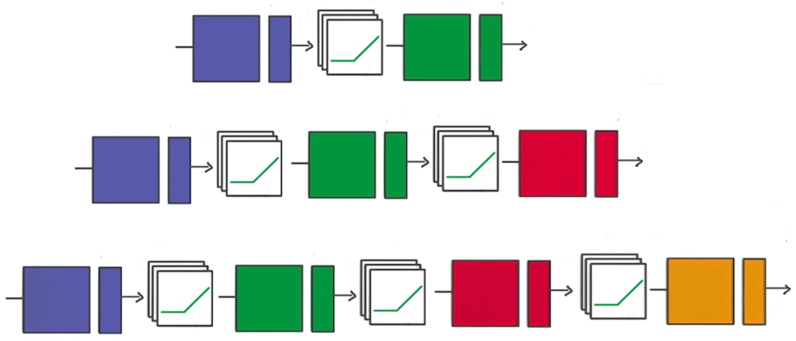

# Deep Neural Network In TensorFlow

You've seen how to build a logistic classifier using TensorFlow. Now you're going to see how to use the logistic classifier to build a deep neural network.

### Step by Step

In the following walkthrough, we'll step through TensorFlow code written to classify the letters in the MNIST database. If you would like to run the network on your computer, the file is provided [here](https://d17h27t6h515a5.cloudfront.net/topher/2017/February/58a61a3a_multilayer-perceptron/multilayer-perceptron.zip). You can find this and many more examples of TensorFlow at [Aymeric Damien's GitHub repository](https://github.com/aymericdamien/TensorFlow-Examples).

### Code

#### TensorFlow MNIST

```python
from tensorflow.examples.tutorials.mnist import input_data
mnist = input_data.read_data_sets(".", one_hot=True, reshape=False)
```

You'll use the MNIST dataset provided by TensorFlow, which batches and One-Hot encodes the data for you.

### Learning Parameters

```python
import tensorflow as tf

# Parameters
learning_rate = 0.001
training_epochs = 20
batch_size = 128  # Decrease batch size if you don't have enough memory
display_step = 1

n_input = 784  # MNIST data input (img shape: 28*28)
n_classes = 10  # MNIST total classes (0-9 digits)
```

The focus here is on the architecture of multilayer neural networks, not parameter tuning, so here we'll just give you the learning parameters.

### Hidden Layer Parameters

```python
n_hidden_layer = 256 # layer number of features
```

The variable **n_hidden_layer** determines the size of the hidden layer in the neural network. This is also known as the width of a layer.

### Weights and Biases

```python
# Store layers weight & bias
weights = {
    'hidden_layer': tf.Variable(tf.random_normal([n_input, n_hidden_layer])),
    'out': tf.Variable(tf.random_normal([n_hidden_layer, n_classes]))
}
biases = {
    'hidden_layer': tf.Variable(tf.random_normal([n_hidden_layer])),
    'out': tf.Variable(tf.random_normal([n_classes]))
}
```

Deep neural networks use multiple layers with each layer requiring it's own weight and bias. The **'hidden_layer'** weight and bias is for the hidden layer. The 'out' weight and bias is for the output layer. If the neural network were deeper, there would be weights and biases for each additional layer.

#### Input

```python
# tf Graph input
x = tf.placeholder("float", [None, 28, 28, 1])
y = tf.placeholder("float", [None, n_classes])

x_flat = tf.reshape(x, [-1, n_input])
```

The MNIST data is made up of 28px by 28px images with a single [channel](https://en.wikipedia.org/wiki/Channel_(digital_image%29). The **tf.reshape()** function above reshapes the 28px by 28px matrices in x into row vectors of 784px.

### Multilayer Perceptron


```python
# Hidden layer with RELU activation
layer_1 = tf.add(tf.matmul(x_flat, weights['hidden_layer']),\
    biases['hidden_layer'])
layer_1 = tf.nn.relu(layer_1)
# Output layer with linear activation
logits = tf.add(tf.matmul(layer_1, weights['out']), biases['out'])
```

You've seen the linear function **tf.add(tf.matmul(x_flat, weights['hidden_layer'])**, biases['hidden_layer']) before, also known as **xw + b**. Combining linear functions together using a ReLU will give you a two layer network.

### Optimizer

```python
# Define loss and optimizer
cost = tf.reduce_mean(\
    tf.nn.softmax_cross_entropy_with_logits(logits=logits, labels=y))
optimizer = tf.train.GradientDescentOptimizer(learning_rate=learning_rate)\
    .minimize(cost)
```

This is the same optimization technique used in the Intro to TensorFLow lab.

### Session

```python
# Initializing the variables
init = tf.global_variables_initializer()


# Launch the graph
with tf.Session() as sess:
    sess.run(init)
    # Training cycle
    for epoch in range(training_epochs):
        total_batch = int(mnist.train.num_examples/batch_size)
        # Loop over all batches
        for i in range(total_batch):
            batch_x, batch_y = mnist.train.next_batch(batch_size)
            # Run optimization op (backprop) and cost op (to get loss value)
            sess.run(optimizer, feed_dict={x: batch_x, y: batch_y})
```

The MNIST library in TensorFlow provides the ability to receive the dataset in batches. Calling the **mnist.train.next_batch()** function returns a subset of the training data.

### Deeper Neural Network



That's it! Going from one layer to two is easy. Adding more layers to the network allows you to solve more complicated problems. In the next video, you'll see how changing the number of layers can affect your network.
