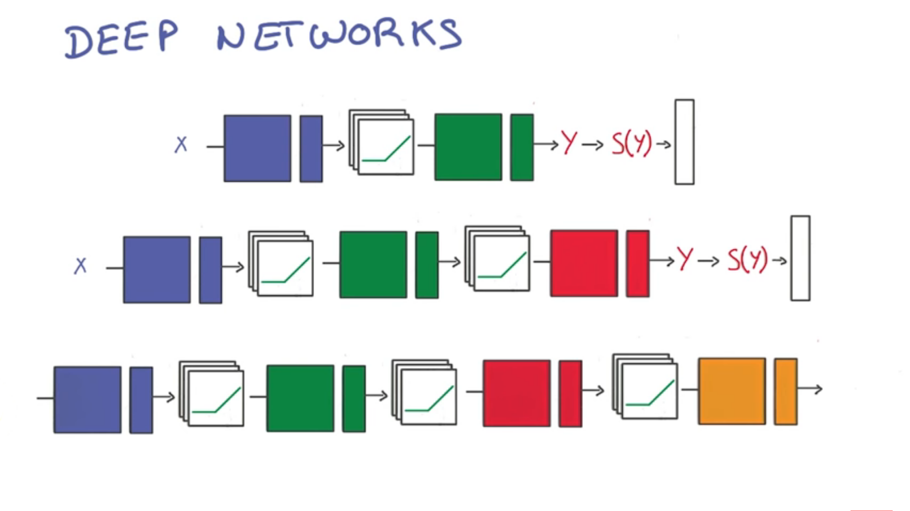

# Training A Deep Neural Network

We now have the small neural network:

#### x => * w1 + b1 => H RELUs => * w2 + b2 => y => S(y) => Output

Ours currently only has two layers, but we could change this by adding more hidden layers in the middle of our equation

Increasing the **H** to add more RELUs is not particularly efficient because the bigger it gets the harder it is to train. **This is where the central idea of deep learning comes into play**. Instead of increasing the **H** value to add more RELUs, you can add more layers and make the model *deeper*. 

Another reason is because parameter efficiency. It is better to add more layers and have less parameters than to add more parameters to less layers.

Lastly, it is easier to visualize your model if it has more layers rather than more parameters.

***

Earlier in your neural net you will see very simple things like lines and edges. As you get to the last few layers of your neural net you will see more complex things, like shapes, and even objects.

This is very powerful because the model structure matches the kind of abstractions that you might expect to see in your data. As a result, the model has an easier time learning them. 
