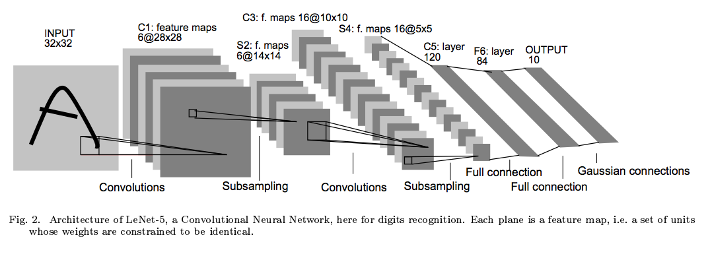

# LeNet In TensorFlow Lab



LeNet. Source: Yann Lecun.

You're now going to put together everything you've learned and implement the LeNet architecture using TensorFlow.

When you get to your next project, remember that LeNet can be a great starting point for your network architecture!

#### Instructions:

1. Set up your development environment with the CarND Starter Kit
2. git clone https://github.com/udacity/CarND-LeNet-Lab.git
3. cd CarND-LeNet-Lab
4. jupyter notebook
5. Finish off the architecture implementation in the LeNet function. That's the only piece that's missing.

### Preprocessing

An MNIST image is initially 784 features (1D). We reshape this to (28, 28, 1) (3D), normalize such that the values are between 0-1 instead of 0-255, and finally, pad the image with 0s such that the height and width are 32 (centers digit further). Thus, the input shape going into the first convolutional layer is 32x32x1.

#### Specs

**Convolution layer 1.** The output shape should be 28x28x6.

**Activation 1**. Your choice of activation function.

**Pooling layer 1**. The output shape should be 14x14x6.

**Convolution layer 2**. The output shape should be 10x10x16.

**Activation 2**. Your choice of activation function.

**Pooling layer 2**. The output shape should be 5x5x16.

**Flatten layer**. Flatten the output shape of the final pooling layer such that it's 1D instead of 3D. The easiest way to do is by using tf.contrib.layers.flatten, which is already imported for you.

**Fully connected layer 1**. This should have 120 outputs.

**Activation 3**. Your choice of activation function.

**Fully connected layer 2**. This should have 84 outputs.

**Activation 4**. Your choice of activation function.

**Fully connected layer 3**. This should have 10 outputs.

You'll return the result of the final fully connected layer from the LeNet function.

If implemented correctly you should see output similar to the following:

```
EPOCH 1 ...
Validation loss = 52.809
Validation accuracy = 0.864

EPOCH 2 ...
Validation loss = 24.749
Validation accuracy = 0.915

EPOCH 3 ...
Validation loss = 17.719
Validation accuracy = 0.930

EPOCH 4 ...
Validation loss = 12.188
Validation accuracy = 0.943

EPOCH 5 ...
Validation loss = 8.935
Validation accuracy = 0.954

EPOCH 6 ...
Validation loss = 7.674
Validation accuracy = 0.956

EPOCH 7 ...
Validation loss = 6.822
Validation accuracy = 0.956

EPOCH 8 ...
Validation loss = 5.451
Validation accuracy = 0.961

EPOCH 9 ...
Validation loss = 4.881
Validation accuracy = 0.964

EPOCH 10 ...
Validation loss = 4.623
Validation accuracy = 0.964

Test loss = 4.726
Test accuracy = 0.962
```

#### Parameters Galore

As an additional fun exercise calculate the total number of parameters used by the network. Note, the convolutional layers use weight sharing!

***

### LeNet.py

```python
"""
LeNet Architecture

HINTS for layers:

    Convolutional layers:

    tf.nn.conv2d
    tf.nn.max_pool

    For preparing the convolutional layer output for the
    fully connected layers.

    tf.contrib.flatten
"""
import tensorflow as tf
from tensorflow.examples.tutorials.mnist import input_data
from tensorflow.contrib.layers import flatten


EPOCHS = 10
BATCH_SIZE = 50


# LeNet architecture:
# INPUT -> CONV -> ACT -> POOL -> CONV -> ACT -> POOL -> FLATTEN -> FC -> ACT -> FC
#
# Don't worry about anything else in the file too much, all you have to do is
# create the LeNet and return the result of the last fully connected layer.
def LeNet(x):
    # Reshape from 2D to 4D. This prepares the data for
    # convolutional and pooling layers.
    x = tf.reshape(x, (-1, 28, 28, 1))
    # Pad 0s to 32x32. Centers the digit further.
    # Add 2 rows/columns on each side for height and width dimensions.
    x = tf.pad(x, [[0, 0], [2, 2], [2, 2], [0, 0]], mode="CONSTANT")
    # TODO: Define the LeNet architecture.
    # Return the result of the last fully connected layer.
    return x


# MNIST consists of 28x28x1, grayscale images
x = tf.placeholder(tf.float32, (None, 784))
# Classify over 10 digits 0-9
y = tf.placeholder(tf.float32, (None, 10))
fc2 = LeNet(x)

loss_op = tf.reduce_mean(tf.nn.softmax_cross_entropy_with_logits(fc2, y))
opt = tf.train.AdamOptimizer()
train_op = opt.minimize(loss_op)
correct_prediction = tf.equal(tf.argmax(fc2, 1), tf.argmax(y, 1))
accuracy_op = tf.reduce_mean(tf.cast(correct_prediction, tf.float32))


def eval_data(dataset):
    """
    Given a dataset as input returns the loss and accuracy.
    """
    # If dataset.num_examples is not divisible by BATCH_SIZE
    # the remainder will be discarded.
    # Ex: If BATCH_SIZE is 64 and training set has 55000 examples
    # steps_per_epoch = 55000 // 64 = 859
    # num_examples = 859 * 64 = 54976
    #
    # So in that case we go over 54976 examples instead of 55000.
    steps_per_epoch = dataset.num_examples // BATCH_SIZE
    num_examples = steps_per_epoch * BATCH_SIZE
    total_acc, total_loss = 0, 0
    sess = tf.get_default_session()
    for step in range(steps_per_epoch):
        batch_x, batch_y = dataset.next_batch(BATCH_SIZE)
        loss, acc = sess.run([loss_op, accuracy_op], feed_dict={x: batch_x, y: batch_y})
        total_acc += (acc * batch_x.shape[0])
        total_loss += (loss * batch_x.shape[0])
    return total_loss/num_examples, total_acc/num_examples


if __name__ == '__main__':
    # Load data
    mnist = input_data.read_data_sets("MNIST_data/", one_hot=True)

    with tf.Session() as sess:
        sess.run(tf.global_variables_initializer())
        steps_per_epoch = mnist.train.num_examples // BATCH_SIZE
        num_examples = steps_per_epoch * BATCH_SIZE

        # Train model
        for i in range(EPOCHS):
            for step in range(steps_per_epoch):
                batch_x, batch_y = mnist.train.next_batch(BATCH_SIZE)
                loss = sess.run(train_op, feed_dict={x: batch_x, y: batch_y})

            val_loss, val_acc = eval_data(mnist.validation)
            print("EPOCH {} ...".format(i+1))
            print("Validation loss = {:.3f}".format(val_loss))
            print("Validation accuracy = {:.3f}".format(val_acc))
            print()

        # Evaluate on the test data
        test_loss, test_acc = eval_data(mnist.test)
        print("Test loss = {:.3f}".format(test_loss))
        print("Test accuracy = {:.3f}".format(test_acc))

```

***

### Solution

You can see [one implementation of the solution](https://github.com/udacity/CarND-LeNet-Lab/blob/master/LeNet-Lab-Solution.ipynb) in the GitHub repo.

Here is the LeNet function:

```python
def LeNet(x):    
    # Hyperparameters
    mu = 0
    sigma = 0.1

    # SOLUTION: Layer 1: Convolutional. Input = 32x32x1. Output = 28x28x6.
    conv1_W = tf.Variable(tf.truncated_normal(shape=(5, 5, 1, 6), mean = mu, stddev = sigma))
    conv1_b = tf.Variable(tf.zeros(6))
    conv1   = tf.nn.conv2d(x, conv1_W, strides=[1, 1, 1, 1], padding='VALID') + conv1_b

    # SOLUTION: Activation.
    conv1 = tf.nn.relu(conv1)

    # SOLUTION: Pooling. Input = 28x28x6. Output = 14x14x6.
    conv1 = tf.nn.max_pool(conv1, ksize=[1, 2, 2, 1], strides=[1, 2, 2, 1], padding='VALID')

    # SOLUTION: Layer 2: Convolutional. Output = 10x10x16.
    conv2_W = tf.Variable(tf.truncated_normal(shape=(5, 5, 6, 16), mean = mu, stddev = sigma))
    conv2_b = tf.Variable(tf.zeros(16))
    conv2   = tf.nn.conv2d(conv1, conv2_W, strides=[1, 1, 1, 1], padding='VALID') + conv2_b

    # SOLUTION: Activation.
    conv2 = tf.nn.relu(conv2)

    # SOLUTION: Pooling. Input = 10x10x16. Output = 5x5x16.
    conv2 = tf.nn.max_pool(conv2, ksize=[1, 2, 2, 1], strides=[1, 2, 2, 1], padding='VALID')

    # SOLUTION: Flatten. Input = 5x5x16. Output = 400.
    fc0   = flatten(conv2)

    # SOLUTION: Layer 3: Fully Connected. Input = 400. Output = 120.
    fc1_W = tf.Variable(tf.truncated_normal(shape=(400, 120), mean = mu, stddev = sigma))
    fc1_b = tf.Variable(tf.zeros(120))
    fc1   = tf.matmul(fc0, fc1_W) + fc1_b

    # SOLUTION: Activation.
    fc1    = tf.nn.relu(fc1)

    # SOLUTION: Layer 4: Fully Connected. Input = 120. Output = 84.
    fc2_W  = tf.Variable(tf.truncated_normal(shape=(120, 84), mean = mu, stddev = sigma))
    fc2_b  = tf.Variable(tf.zeros(84))
    fc2    = tf.matmul(fc1, fc2_W) + fc2_b

    # SOLUTION: Activation.
    fc2    = tf.nn.relu(fc2)

    # SOLUTION: Layer 5: Fully Connected. Input = 84. Output = 10.
    fc3_W  = tf.Variable(tf.truncated_normal(shape=(84, 10), mean = mu, stddev = sigma))
    fc3_b  = tf.Variable(tf.zeros(10))
    logits = tf.matmul(fc2, fc3_W) + fc3_b

    return logits
```

### Walkthrough

Let's go through this solution layer by layer.

```python
# Hyperparameters
mu = 0
sigma = 0.1
```

This solution uses the **tf.truncated_normal()** function to initialize the weights and bias Variables. Using the default mean and standard deviation from **tf.truncated_normal()** is fine. However, tuning these hyperparameters can result in better performance.

```python
# SOLUTION: Layer 1: Convolutional. Input = 32x32x1. Output = 28x28x6.
conv1_W = tf.Variable(tf.truncated_normal(shape=(5, 5, 1, 6), mean = mu, stddev = sigma))
conv1_b = tf.Variable(tf.zeros(6))
conv1   = tf.nn.conv2d(x, conv1_W, strides=[1, 1, 1, 1], padding='VALID') + conv1_b
```

This layer transforms the Tensor **32x32x1** to **28x28x6**.

Use a filter with the shape (5, 5, 1, 6) with **VALID** padding.

Recall the shape has dimensions: (height, width, input_depth, output_depth).

With **VALID** padding, the formula for the new height and width is:

```
out_height = ceil(float(in_height - filter_height + 1) / float(strides[1]))
out_width  = ceil(float(in_width - filter_width + 1) / float(strides[2]))
```

Plugging in values:

```
out_height = ceil(float(32 - 5 + 1) / float(1)) = 28
out_width = ceil(float(32 - 5 + 1) / float(1)) = 28
```

Clearly, the strides must equal 1, or the output would be too small.

```python
# SOLUTION: Activation.
conv1 = tf.nn.relu(conv1)
```

A standard **ReLU** activation. You might have chosen another activation.

```python
# SOLUTION: Pooling. Input = 10x10x16. Output = 5x5x16.
conv2 = tf.nn.max_pool(conv2, ksize=[1, 2, 2, 1], strides=[1, 2, 2, 1], padding='VALID')
```

The formula to calculate the new height and width for a pooling layer mirrors the formula for a convolutional layer.

```python
new_height = ceil(float(28 - 2 + 1) / float(2)) = ceil(13.5) = 14
new_width = ceil(float(28 - 2 + 1) / float(2)) = ceil(13.5) = 14
```

The next round of **convolution -> activation -> pooling** uses an identical methodology.

```python
# SOLUTION: Flatten Layer.
fc0 = flatten(conv2)
```

The **flatten** function flattens a **Tensor** into two dimensions: (batches, length). The batch size remains unaltered, so all of the other dimensions of the input Tensor are flattened into the second dimension of the output Tensor.

In this model, the the output shape of Pooling Layer 2 should be 5x5x16 (ignoring batch size). Applying **flatten** will multiply the length of each dimension together, which equals 400.

Now that the **Tensor** is 2D, it's ready to be used in fully connected layers.

```python
# SOLUTION: Layer 3: Fully Connected. Input = 400. Output = 120.
fc1_W = tf.Variable(tf.truncated_normal(shape=(400, 120), mean = mu, stddev = sigma))
fc1_b = tf.Variable(tf.zeros(120))
fc1   = tf.matmul(fc0, fc1_W) + fc1_b

# SOLUTION: Activation.
fc1    = tf.nn.relu(fc1)

# SOLUTION: Layer 4: Fully Connected. Input = 120. Output = 84.
fc2_W  = tf.Variable(tf.truncated_normal(shape=(120, 84), mean = mu, stddev = sigma))
fc2_b  = tf.Variable(tf.zeros(84))
fc2    = tf.matmul(fc1, fc2_W) + fc2_b

# SOLUTION: Activation.
fc2    = tf.nn.relu(fc2)

# SOLUTION: Layer 5: Fully Connected. Input = 84. Output = 10.
fc3_W  = tf.Variable(tf.truncated_normal(shape=(84, 10), mean = mu, stddev = sigma))
fc3_b  = tf.Variable(tf.zeros(10))
logits = tf.matmul(fc2, fc3_W) + fc3_b
```

You're already familiar with fully connected layers so I won't go into much detail. Note the output sizes: **120**, **84**, and **10**.

Congratulations! You're now a convolution and pooling expert!

***

### Additional Resources

There are many wonderful free resources that allow you to go into more depth around Convolutional Neural Networks. In this course, our goal is to give you just enough intuition to start applying this concept on real world problems so you have enough of an exposure to explore more on your own. We strongly encourage you to explore some of these resources more to reinforce your intuition and explore different ideas.

These are the resources we recommend in particular:

- Andrej Karpathy's [CS231n Stanford course](http://cs231n.github.io/) on Convolutional Neural Networks.
- Michael Nielsen's [free book](http://neuralnetworksanddeeplearning.com/) on Deep Learning.
- Goodfellow, Bengio, and Courville's more advanced [free book](http://deeplearningbook.org/) on Deep Learning.
