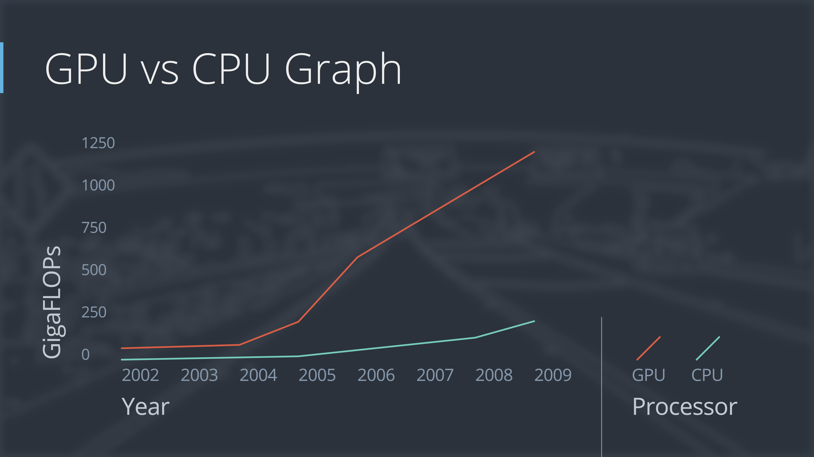

# GPU Vs CPU

GPUs can help a lot with rendering graphically intense video games, but GPUs have also become extraordinarily important for deep learning

GPUs are optimized for *high-throughput computing* (use of many computing resources over long periods of time to accomplish a computational task)

CPUs are mostly optimized for latency running a single thread of instructions as quickly as possible

Throughput computing is important for computer graphics because we want to update lots of pixels on the screen at the same time. It turns out that throughput computing is also important for deep learning because the computations fundamental to deep learning have a lot of parallelism.

Training a network on a GPU vs a CPU will have different performance results. For example, a low-power processor in a laptop is going to be much slower than a big server processor. A rule of thumb would be that network strain about five times faster on a GPU than on a CPU.

***

### GPU vs CPU Performance Increase Over Time

The chart below gives a general idea of how, over time, GPU performance has increased faster than CPU performance. The data is based on a comparison of NVIDIA GPUs and Intel CPUs.

