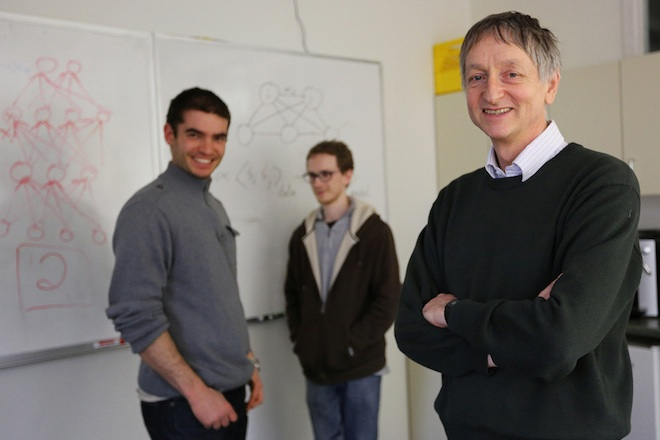

# Transfer Learning With TensorFlow

**Transfer learning** is the practice of starting with a network that has already been trained, and then applying that network to your own problem.

Because neural networks can often take days or even weeks to train, transfer learning (i.e. starting with a network that somebody else has already trained) can greatly shorten training time.

How do we apply transfer learning? Two popular methods are **feature extraction** and **finetuning**.

1. **Feature extraction**. Take a pretrained neural network and replace the final (classification) layer with a new classification layer, or perhaps even a small feedforward network that ends with a new classification layer. During training the weights in all the pre-trained layers are frozen, so only the weights for the new layer(s) are trained. In other words, the gradient doesn't flow backwards past the first new layer.
2. **Finetuning**. This is similar to feature extraction except the pre-trained weights aren't frozen. The network is trained end-to-end.

The labs in this lesson will focus on feature extraction since it's less computationally intensive.

### Getting Started

1. Set up your environment with the [Udacity CarND Starter Kit](https://github.com/udacity/CarND-Term1-Starter-Kit).
2. Clone the repository containing the code.

```
git clone https://github.com/udacity/CarND-Alexnet-Feature-Extraction
cd CarND-Alexnet-Feature-Extraction
```

3. Download the [training data](https://d17h27t6h515a5.cloudfront.net/topher/2016/October/580a829f_train/train.p) and [AlexNet weights](https://d17h27t6h515a5.cloudfront.net/topher/2016/October/580d880c_bvlc-alexnet/bvlc-alexnet.npy). These links are also available at the bottom of this page under **Supporting Materials**.
4. Make sure the downloaded files are in the same directory as the code.
5. Open the code in your favorite editor.

### Feature Extraction via AlexNet

Here, you're going to practice feature extraction with [AlexNet](https://www.google.com/url?sa=t&rct=j&q=&esrc=s&source=web&cd=1&cad=rja&uact=8&ved=0ahUKEwiG34CS7vHPAhVKl1QKHW2JAJkQFggcMAA&url=https%3A%2F%2Fpapers.nips.cc%2Fpaper%2F4824-imagenet-classification-with-deep-convolutional-neural-networks.pdf&usg=AFQjCNFlGsSmTUkJw0gLJ0Ry4cm961B7WA&bvm=bv.136593572,d.cGw).

AlexNet is a popular base network for transfer learning because its structure is relatively straightforward, it's not too big, and it performs well empirically.

There is a TensorFlow implementation of AlexNet (adapted from [Michael Guerhoy and Davi Frossard](http://www.cs.toronto.edu/~guerzhoy/tf_alexnet/)) in **alexnet.py**. You're not going to edit anything in this file but it's a good idea to skim through it to see how AlexNet is defined in TensorFlow.



The team behind AlexNet. Source: Wired.

Coming up, you'll practice using AlexNet for inference on the image set it was trained on.

After that, you'll extract AlexNet's features and use them to classify images from the [German Traffic Sign Recognition Benchmark dataset](http://benchmark.ini.rub.de/?section=gtsrb&subsection=dataset).

#### Credits

This lab utilizes:

- An implementation of AlexNet created by Michael Guerzhoy and Davi Frossard
- AlexNet weights provided by the Berkeley Vision and Learning Center
- Training data from the German Traffic Sign Recognition Benchmark

AlexNet was originally trained on the [ImageNet database](http://www.image-net.org/).

***

### ImageNet Inference Output

To start, run imagenet_inference.py, and verify that the network classifies the images correctly.

```
python imagenet_inference.py
```

Your output should look similar to this:


```
Image 0
miniature poodle: 0.389
toy poodle: 0.223
Bedlington terrier: 0.173
standard poodle: 0.150
komondor: 0.026

Image 1
weasel: 0.331
polecat, fitch, foulmart, foumart, Mustela putorius: 0.280
black-footed ferret, ferret, Mustela nigripes: 0.210
mink: 0.081
Arctic fox, white fox, Alopex lagopus: 0.027

Time: 5.587 seconds
```

***

### Traffic Sign Inference

Next, run **python traffic_sign_inference.py**, and see how well the classifier performs on the example construction and stop signs.

OH NO!

AlexNet expects a 227x227x3 pixel image, whereas the traffic sign images are 32x32x3 pixels.

In order to feed the traffic sign images into AlexNet, you'll need to resize the images to the dimensions that AlexNet expects.

You could resize the images outside of this program, but that approach doesn't scale well. Instead, use the **tf.image.resize_images** method to resize the images as they are fed into the model.

Open up **traffic_sign_inference.py** and complete the **TODO**(s).

Your output should look similar to this:

```
Image 0
screen, CRT screen: 0.051
digital clock: 0.041
laptop, laptop computer: 0.030
balance beam, beam: 0.027
parallel bars, bars: 0.023

Image 1
digital watch: 0.395
digital clock: 0.275
bottlecap: 0.115
stopwatch, stop watch: 0.104
combination lock: 0.086

Time: 0.592 seconds
```

#### Solution

```python
"""
The traffic signs are 32x32 so you
have to resize them to be 227x227 before
passing them to AlexNet.
"""
import time
import tensorflow as tf
import numpy as np
from scipy.misc import imread
from caffe_classes import class_names
from alexnet import AlexNet


# placeholders
x = tf.placeholder(tf.float32, (None, 32, 32, 3))
resized = tf.image.resize_images(x, (227, 227))

probs = AlexNet(resized)
init = tf.initialize_all_variables()
sess = tf.Session()
sess.run(init)

# Read Images
im1 = imread("construction.jpg").astype(np.float32)
im1 = im1 - np.mean(im1)

im2 = imread("stop.jpg").astype(np.float32)
im2 = im2 - np.mean(im2)

# Run Inference
t = time.time()
output = sess.run(probs, feed_dict={x: [im1, im2]})

# Print Output
for input_im_ind in range(output.shape[0]):
    inds = np.argsort(output)[input_im_ind, :]
    print("Image", input_im_ind)
    for i in range(5):
        print("%s: %.3f" % (class_names[inds[-1 - i]], output[input_im_ind, inds[-1 - i]]))
    print()

print("Time: %.3f seconds" % (time.time() - t))
```

The notable part being:

```python
x = tf.placeholder(tf.float32, (None, 32, 32, 3))
resized = tf.image.resize_images(x, (227, 227))
```

AlexNet requires images be 227 by 227. So, we use **tf.image.resize_images** resize the 32 by 32 traffic sign images.
