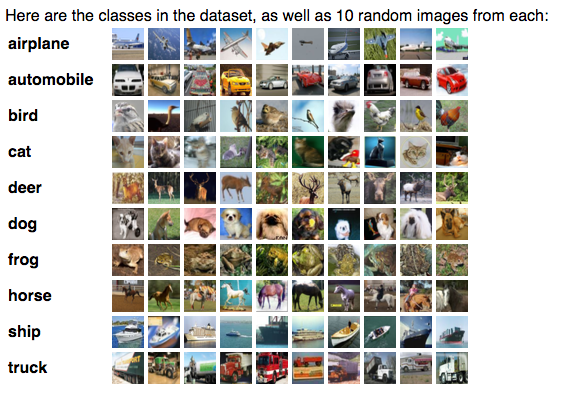

# Transfer Learning with VGG, Inception (GoogLeNet) and ResNet

In this lab, you will continue exploring transfer learning. You've already explored feature extraction with AlexNet and TensorFlow. Next, you will use Keras to explore feature extraction with the VGG, Inception and ResNet architectures. The models you will use were trained for days or weeks on the [ImageNet dataset](http://www.image-net.org/). Thus, the weights encapsulate higher-level features learned from training on thousands of classes.

There are some notable differences from AlexNet lab.

1. We're using two datasets. First, the German Traffic Sign dataset, and second, the [Cifar10 dataset](https://www.cs.toronto.edu/~kriz/cifar.html).
2. **Bottleneck Features**. Unless you have a very powerful GPU, running feature extraction on these models will take a significant amount of time, as you might have observed in the AlexNet lab. To make things easier we've precomputed bottleneck features for each (network, dataset) pair. This will allow you to experiment with feature extraction even on a modest CPU. You can think of bottleneck features as feature extraction but with caching. Because the base network weights are frozen during feature extraction, the output for an image will always be the same. Thus, once the image has already been passed through the network, we can cache and reuse the output.
3. Furthermore, we've limited each class in both training datasets to 100 examples. The idea here is to push feature extraction a bit further. It also greatly reduces the download size and speeds up training. The validation files remain the same.
4. 
The files are encoded as such:

- {network}_{dataset}_100_bottleneck_features_train.p
- {network}_{dataset}_bottleneck_features_validation.p

"network", in the above filenames, can be one of 'vgg', 'inception', or 'resnet'.

"dataset" can be either 'cifar10' or 'traffic'.

#### Getting Started

1. Download one of the bottleneck feature packs. VGG is the smallest so you might want to give that a shot first. You can download these from the **Supplement Materials** at the bottom of this page.
2. Clone the lab repository

```
git clone https://github.com/udacity/CarND-Transfer-Learning-Lab
cd CarND-Transfer-Learning-Lab
```

3. Open **feature_extraction.py** in your favourite text editor. We'll go over the code next.

#### Supporting Materials

[VGG Bottleneck Features 100](https://d17h27t6h515a5.cloudfront.net/topher/2016/November/5834b432_vgg-100/vgg-100.zip)

[ResNet Bottleneck Features 100](https://d17h27t6h515a5.cloudfront.net/topher/2016/November/5834b634_resnet-100/resnet-100.zip)

[InceptionV3 Bottleneck Features 100](https://d17h27t6h515a5.cloudfront.net/topher/2016/November/5834b498_inception-100/inception-100.zip)

***

Ok, I lied! Before we go over feature_extraction.py I want you to do something first ...

Before you try feature extraction on pretrained models I'd like you to take a moment and run the classifier you used in the Traffic Sign project on the Cifar10 dataset. Cifar10 images are also (32, 32, 3) so the only thing you'll need to change is **the number of classes from 43 to 10**.

You can easily download and load the Cifar10 dataset like this:

```python
from keras.datasets import cifar10
(X_train, y_train), (X_test, y_test) = cifar10.load_data()
# y_train.shape is 2d, (50000, 1). While Keras is smart enough to handle this
# it's a good idea to flatten the array.
y_train = y_train.reshape(-1)
y_test = y_test.reshape(-1)
```

The Cifar10 dataset contains 10 classes:



Overview of the Cifar10 dataset. Source: Alex Krizhevsky.
While the German Traffic Sign dataset has more classes, the Cifar10 dataset is harder to classify due to the complexity of the classes. A ship is drastically different from a frog, and a frog is nothing like a deer, etc. These are the kind of datasets where the advantage of using a pre-trained model will become much more apparent.

Train your model on the Cifar10 dataset and record your results, keep these in mind when you train from the bottleneck features. Don't be discouraged if you get results significantly worse than the Traffic Sign dataset.

***

Cool, now that you have a baseline for Cifar10, let's get started with feature extraction.

### The Code

Here's the solution I came up with

```python
import pickle
import tensorflow as tf
import numpy as np
from keras.layers import Input, Flatten, Dense
from keras.models import Model

flags = tf.app.flags
FLAGS = flags.FLAGS

# command line flags
flags.DEFINE_string('training_file', '', "Bottleneck features training file (.p)")
flags.DEFINE_string('validation_file', '', "Bottleneck features validation file (.p)")
flags.DEFINE_integer('epochs', 50, "The number of epochs.")
flags.DEFINE_integer('batch_size', 256, "The batch size.")


def load_bottleneck_data(training_file, validation_file):
    """
    Utility function to load bottleneck features.

    Arguments:
        training_file - String
        validation_file - String
    """
    print("Training file", training_file)
    print("Validation file", validation_file)

    with open(training_file, 'rb') as f:
        train_data = pickle.load(f)
    with open(validation_file, 'rb') as f:
        validation_data = pickle.load(f)

    X_train = train_data['features']
    y_train = train_data['labels']
    X_val = validation_data['features']
    y_val = validation_data['labels']

    return X_train, y_train, X_val, y_val


def main(_):
    # load bottleneck data
    X_train, y_train, X_val, y_val = load_bottleneck_data(FLAGS.training_file, FLAGS.validation_file)

    print(X_train.shape, y_train.shape)
    print(X_val.shape, y_val.shape)

    nb_classes = len(np.unique(y_train))

    # define model
    input_shape = X_train.shape[1:]
    inp = Input(shape=input_shape)
    x = Flatten()(inp)
    x = Dense(nb_classes, activation='softmax')(x)
    model = Model(inp, x)
    model.compile(optimizer='adam', loss='sparse_categorical_crossentropy', metrics=['accuracy'])

    # train model
    model.fit(X_train, y_train, nb_epoch=FLAGS.epochs, batch_size=FLAGS.batch_size, validation_data=(X_val, y_val), shuffle=True)


# parses flags and calls the `main` function above
if __name__ == '__main__':
    tf.app.run()
```

Let's go over the changes.

```python
import numpy as np
from keras.layers import Input, Flatten, Dense
from keras.models import Model
```

Import the additional libraries required.

```python
flags.DEFINE_integer('epochs', 50, "The number of epochs.")
flags.DEFINE_integer('batch_size', 256, "The batch size.")
```

I add a couple of command-line flags to set the number of epochs and batch size. This is more for convenience than anything else.

```python
nb_classes = len(np.unique(y_train))
```

Here I find the number of classes for the dataset. **np.unique** returns all the unique elements of a numpy array. The elements of **y_train** are integers, **0-9** for Cifar10 and **0-42** for Traffic Signs. So, when combined with **len** we get back the number of classes.

```python
# define model
input_shape = X_train.shape[1:]
inp = Input(shape=input_shape)
x = Flatten()(inp)
x = Dense(nb_classes, activation='softmax')(x)
model = Model(inp, x)
model.compile(optimizer='adam', loss='sparse_categorical_crossentropy', metrics=['accuracy'])
```

Here I define a very simple model, a linear layer (**Dense** in Keras terms) followed by a softmax activation. The Adam optimizer is used.

```python
# train model
model.fit(X_train, y_train, nb_epoch=FLAGS.epochs, batch_size=FLAGS.batch_size, validation_data=(X_val, y_val), shuffle=True)
```

Finally, the model is trained. Notice here **FLAGS.epochs** and **FLAGS.batch_size** are used.

After 50 epochs these are the results for each model:

#### VGG

```
Epoch 50/50
1000/1000 [==============================] - 0s - loss: 0.2418 - acc: 0.9540 - val_loss: 0.8759 - val_acc: 0.7235
```

#### Inception

```
Epoch 50/50
1000/1000 [==============================] - 0s - loss: 0.0887 - acc: 1.0000 - val_loss: 1.0428 - val_acc: 0.6556
```

#### ResNet

```
Epoch 50/50
1000/1000 [==============================] - 0s - loss: 0.0790 - acc: 1.0000 - val_loss: 0.8005 - val_acc: 0.7347
```

***

I'd like you to now do the same thing but with the German Traffic Sign dataset. The ImageNet dataset with 1000 classes had no traffic sign images. Will the high-level features learned still be transferable to such a different dataset?

Staying with the VGG example:

```
python feature_extraction.py --training_file bottlenecks/vgg_traffic_100_bottleneck_features_train.p --validation_file bottlenecks/vgg_traffic_bottleneck_features_validation.p
```

The only difference in the filename is we're swapping "cifar10" with "traffic".

Depending on how you wrote your solution you may have to manually change the number of classes back to 43 as well.

How do the feature extraction results compare with your results from the Traffic Sign project?

I used the same code from the Cifar10 solution.

After 50 epochs these are the results for each model:

#### VGG

```
Epoch 50/50
4300/4300 [==============================] - 0s - loss: 0.0873 - acc: 0.9958 - val_loss: 0.4368 - val_acc: 0.8666
```

#### Inception

```
Epoch 50/50
4300/4300 [==============================] - 0s - loss: 0.0276 - acc: 1.0000 - val_loss: 0.8378 - val_acc: 0.7519
```

#### ResNet

```
Epoch 50/50
4300/4300 [==============================] - 0s - loss: 0.0332 - acc: 1.0000 - val_loss: 0.6146 - val_acc: 0.8108
```

***

### Congratulations!

You've trained AlexNet, VGG, GoogLeNet, and ResNet as feature extractors!

To end this lab, let's summarize when we should consider:

1. Feature extraction (train only the top-level of the network, the rest of the network remains fixed)
2. Finetuning (train the entire network end-to-end, start with pre-trained weights)
3. Training from scratch (train the entire network end-to-end, start from random weights)

Consider feature extraction when ...

... the new dataset is small and similar to the original dataset. The higher-level features learned from the original dataset should transfer well to the new dataset.

Consider finetuning when ...

... the new dataset is large and similar to the original dataset. Altering the original weights should be safe because the network is unlikely to overfit the new, large dataset.

... the new dataset is small and very different from the original dataset. You could also make the case for training from scratch. If you choose to finetune, it might be a good idea to only use features from the first few layers of the pre-trained network; features from the final layers of the pre-trained network might be too specific to the original dataset.

Consider training from scratch when ...

... the dataset is large and very different from the original dataset. In this case we have enough data to confidently train from scratch. However, even in this case it might be beneficial to initialize the entire network with pretrained weights and finetune it on the new dataset.

Finally, keep in mind that for a lot of problems you won't need an architecture as complicated and powerful as VGG, Inception, or ResNet. These architectures were made for the task of classifying thousands of complex classes. A smaller network might be a better fit for a smaller problem, especially if you can comfortably train it on moderate hardware.
