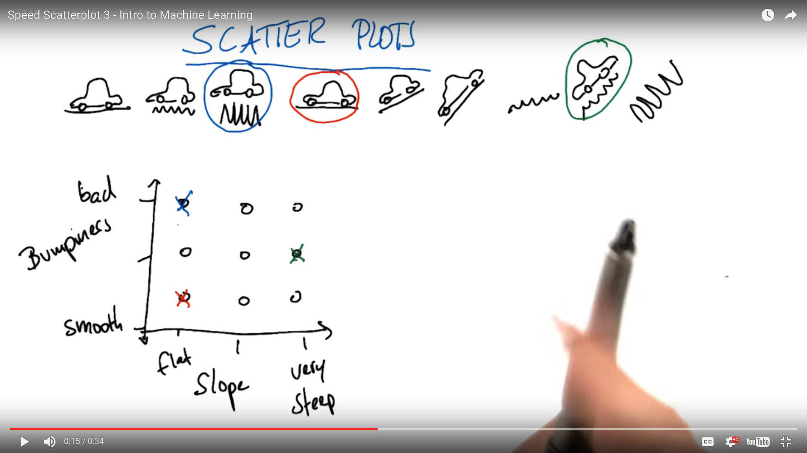

# Stanley Terrain Classification

We want to create a program to tell the car how to drive based on the terrain. To do this, we need to identify features of the terrain that can tell us how we should drive. The two features we will use will be **Steepness** and **Ruggedness** of the terrain.

***

### Scatter Plots



In the above scatterplot you can see how we can plot our data points based on the features we defined: Steepness & Ruggedness

***

### From Scatterplots To Decision Surfaces


In the above picture you can see an example of a scatterplot with some data points plotted in it (Assume they are plotted based on our predefined features). Notice that there is a clear boundary between the red crosses and the blue circles. This is called the **Decision Surface**. On one side of the decision surface our program will make one decision, and on the other side it will make a different decision (For example, drive fast or slow).

Assuming that we are getting input from the sensors on our self-driving car - we can plot new points on our scatterplot as we drive, and then make decisions based on which side of the decision boundary those points are located.

In the previous example we had a decision surface that was curved, but they can also be straight lines. When our decision surface is a straight line we call is a **Linear Decision Surface**. 

***

### Naive Bayes

Using a library called **sklearn** we can implement the *Naive Bayes* algorithm to create a decision surface to classify the data points in our scatter plot.

##### Gaussian Naive Bayes

```python
>>> import numpy as np
>>> X = np.array([[-1, -1], [-2, -1], [-3, -2], [1, 1], [2, 1], [3, 2]]) # features
>>> Y = np.array([1, 1, 1, 2, 2, 2])  # Labels
>>> from sklearn.naive_bayes import GaussianNB  # Import Naive Bayes
>>> clf = GaussianNB()  # Create a classifier
>>> clf.fit(X, Y)       # Fit (train) the data using the training data
GaussianNB(priors=None)
>>> print(clf.predict([[-0.8, -1]])) # Predict what this data point will be based on the others
[1]  # It predicted that the above point would be in class 1
```

##### Quiz

classify.py:

```python
def NBAccuracy(features_train, labels_train, features_test, labels_test):
    """ compute the accuracy of your Naive Bayes classifier """
    ### import the sklearn module for GaussianNB
    from sklearn.naive_bayes import GaussianNB

    ### create classifier
    clf = GaussianNB()

    ### fit the classifier on the training features and labels
    clf.fit(features_train, labels_train)

    ### use the trained classifier to predict labels for the test features
    pred = clf.predict(features_test)
    print(pred)


    ### calculate and return the accuracy on the test data
    ### this is slightly different than the example, 
    ### where we just print the accuracy
    ### you might need to import an sklearn module
    from sklearn.metrics import accuracy_score
    accuracy = accuracy_score(pred, labels_test)
    return accuracy
```

student code:

```python
from class_vis import prettyPicture
from prep_terrain_data import makeTerrainData
from classify import NBAccuracy

import matplotlib.pyplot as plt
import numpy as np
import pylab as pl


features_train, labels_train, features_test, labels_test = makeTerrainData()

def submitAccuracy():
    accuracy = NBAccuracy(features_train, labels_train, features_test, labels_test)
    return accuracy
```

output:

```
[ 0.  1.  1.  0.  1.  1.  1.  0.  1.  1.  1.  1.  1.  0.  0.  1.  0.  1.
  0.  1.  1.  1.  0.  1.  1.  1.  1.  1.  1.  0.  1.  1.  1.  1.  0.  1.
  1.  0.  1.  0.  1.  0.  1.  1.  1.  1.  1.  1.  0.  1.  0.  1.  0.  1.
  1.  0.  1.  0.  1.  1.  1.  1.  1.  1.  0.  1.  1.  0.  1.  1.  1.  1.
  1.  1.  1.  0.  1.  0.  1.  1.  1.  1.  1.  1.  1.  1.  0.  0.  0.  1.
  0.  1.  1.  1.  1.  1.  1.  0.  1.  1.  1.  0.  0.  1.  1.  1.  1.  0.
  1.  1.  1.  1.  1.  1.  0.  1.  0.  0.  0.  0.  1.  1.  0.  1.  1.  1.
  1.  1.  0.  0.  0.  0.  1.  1.  1.  1.  1.  0.  1.  1.  1.  0.  1.  1.
  0.  1.  1.  0.  1.  0.  1.  1.  1.  0.  0.  1.  1.  1.  0.  1.  1.  1.
  0.  1.  1.  0.  1.  1.  1.  1.  1.  1.  1.  1.  0.  0.  1.  1.  1.  1.
  1.  1.  0.  0.  0.  1.  1.  1.  1.  0.  1.  1.  1.  1.  1.  0.  1.  0.
  1.  1.  1.  1.  1.  1.  1.  1.  0.  1.  1.  1.  1.  0.  1.  1.  1.  0.
  0.  1.  0.  1.  0.  1.  1.  1.  1.  0.  1.  1.  0.  0.  0.  1.  0.  1.
  0.  1.  1.  0.  1.  1.  0.  0.  0.  1.  1.  0.  1.  1.  1.  1.]
{"accuracy": "0.884"}
```

***

### Training & Testing Data

In the above code **we train and test on different sets of data**. This is very important in machine learning because if you don't do that you will overfit your training data. This will make it hard for your program to generalize data it will see in the real world.

To solve this problem, we should save 10%-20% of our training data and use it as testing data. When we test our classifier - since this will be new data our classifier has never seen - it does a good job of simulating what it will be like in the real world when the classifier sees new data for the first time.

***

### Naive Bayes Strengths & Weaknesses

Naive Bayes is good because:

- It is easy to implement
- It is very efficient to run this algorithm on large datasets

Naive Bayes is bad at:

- It can't handle phrases that are composed of multiple words (If you search "Chicago Bulls" it will give you pictures of Chicago and pictures of Bulls, not basketball)
