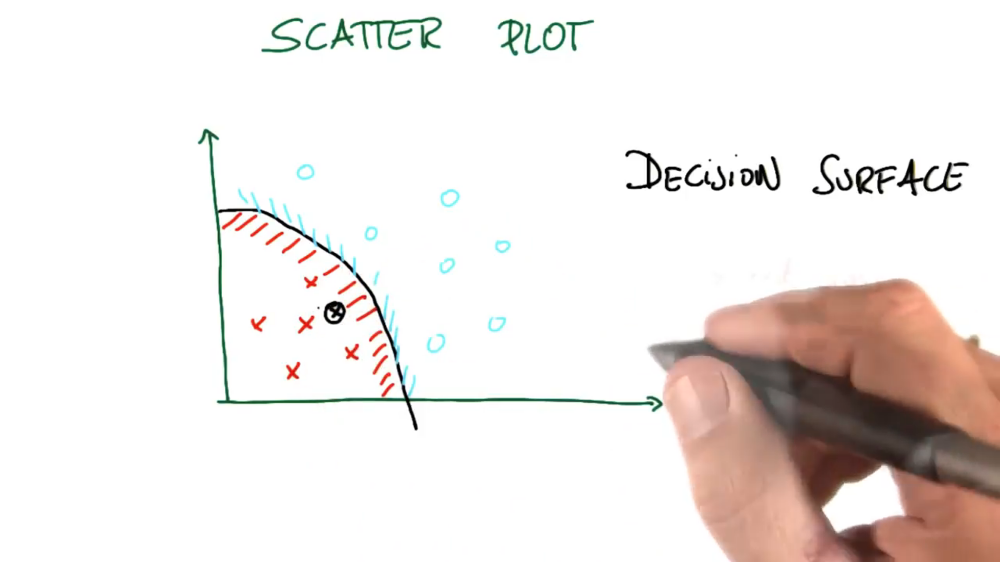

# Scatter Plots

In the above scatterplot you can see how we can plot our data points based on the features we defined: Steepness & Ruggedness

***

### From Scatterplots To Decision Surfaces

In the above picture you can see an example of a scatterplot with some data points plotted in it (Assume they are plotted based on our predefined features). Notice that there is a clear boundary between the red crosses and the blue circles. This is called the **Decision Surface**. On one side of the decision surface our program will make one decision, and on the other side it will make a different decision (For example, drive fast or slow).

Assuming that we are getting input from the sensors on our self-driving car - we can plot new points on our scatterplot as we drive, and then make decisions based on which side of the decision boundary those points are located.

In the previous example we had a decision surface that was curved, but they can also be straight lines. When our decision surface is a straight line we call is a **Linear Decision Surface**. 
