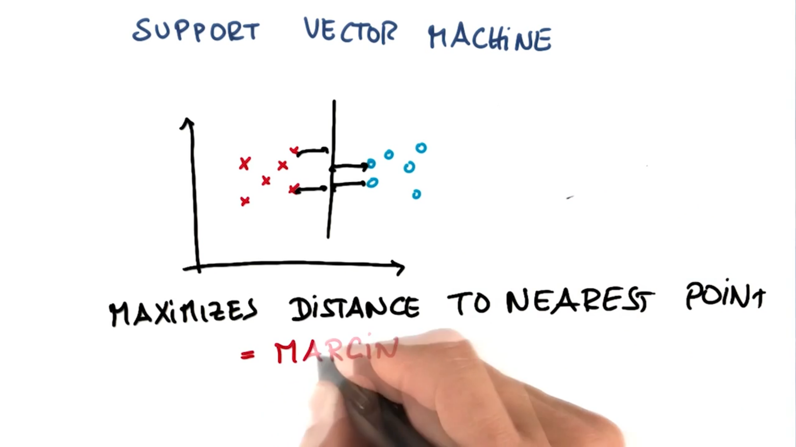
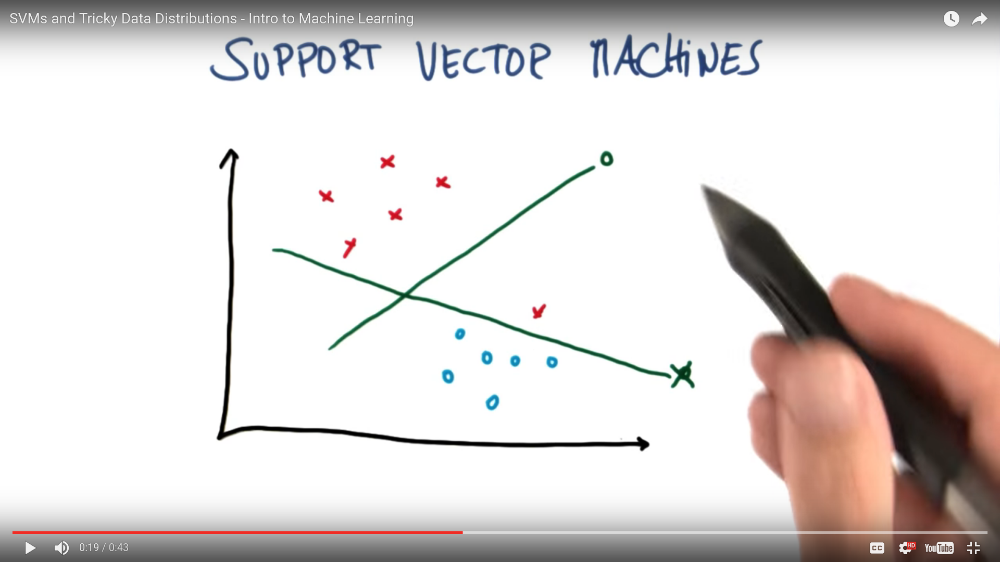

# Support Vectors Machines (SVM)

SVM's draw a line between our data called a **hyperplane** that maximizes the distance between the nearest point relative to both classes

The **margin** is the distance between the line and either of the two classes, and the space that we are trying to maximize

In the above example the SVM would draw the lower line, not the upper one because the upper one classifies one of the red crosses incorrectly

In Support Vector Machines we are trying to classify correctly, and subject to that constant, you are trying to maximize the margin

***

### Outliers

Sometimes our data will have outliers that will prevent our SVM from being able to draw a correct line. In the case, we will not be able to classify all points correctly but we want our SVM to do the best it can knowing that the answer will not be perfect.

SVM's are able to find the decision boundary that maximizes the clearance to both datasets and tolerates individual outliers
