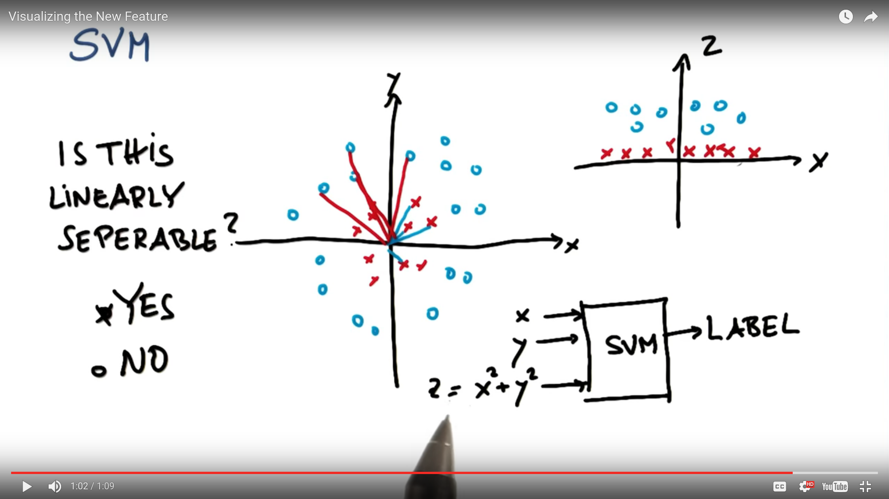
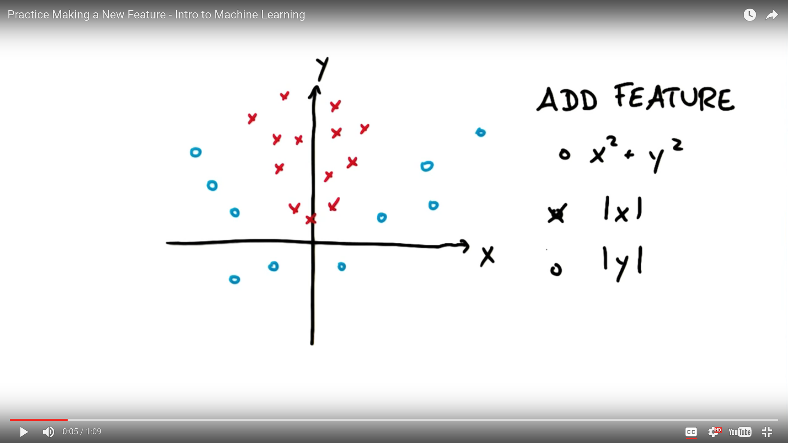
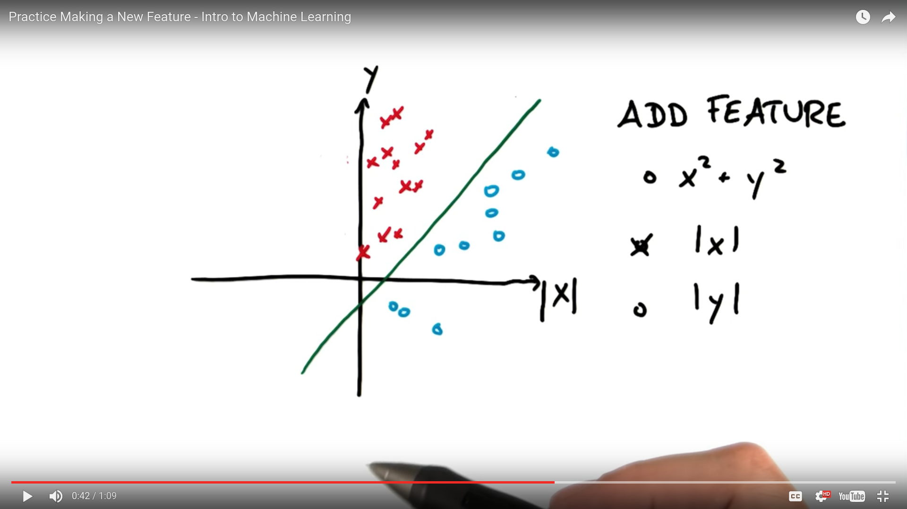

# Nonlinear SVMs

SVMs don't need to draw linear decision boundaries, then can draw nonlinear ones too. This is useful when you have a scatterplot with a lot of data in will multiples clusters for the same classes.

### New Feature

In the above example we create a new features called **z** that is equal to our features **x** squared plus our feature **y** squared. We visualize our new feature **z** in the graph in the upper right-hand corner. Notice that all the red crosses have a low value, and all the blue circles have a high value. Now our data is linearly separable so we can draw a linear SVM through this new graph to classify our data.

The above graph is not linearly separable. We can make in linearly separable by adding a new feature: |x|.

If we graph this new feature |x|, we get an output of the above graph which is linearly separable
