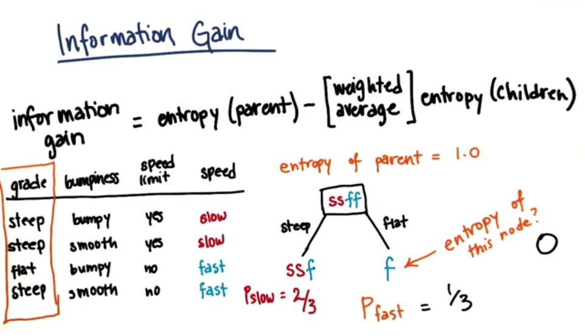
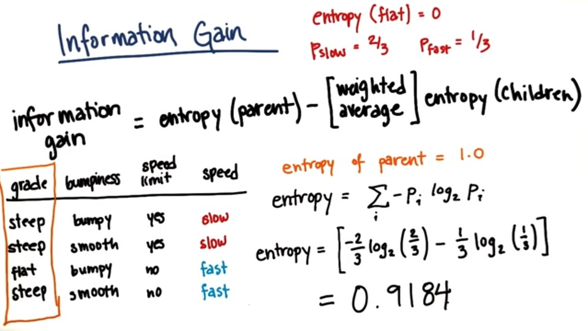
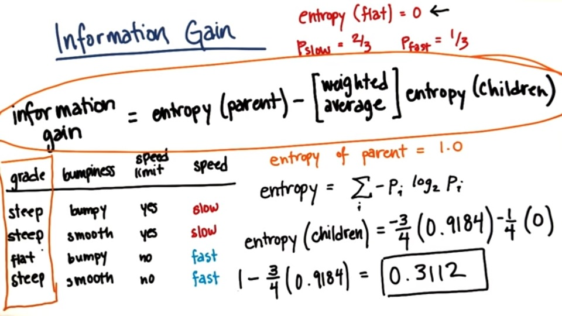

# Information Gain

**Information Gain** is defined as the entropy of the parent minus the weighted average of the children that would result if you split that parent

> (Information Gain) = entropy(parent) - entropy(weighted average of children)

The decision tree algorithm will maximize information gain. This is how it will choose which feature to make a split on, and in cases where the feature has many different values that it can take, this will help it figure out where to make that split. It is going to try to maximize the information gain.

***

### Information Gain Example

| grade     | bumpiness | speed limit | speed |
|:---------:|:---------:|:-----------:|:-----:|
| steep     | bumpy     | yes         | slow  |
| steep     | smooth    | yes         | slow  |
| flat      | bumpy     | no          | fast  |
| steep     | smooth    | no          | fast  |

In the above picture we relate the grade class to the speed class. The parent node for the above table has "ssff" in it where "s" stands for "slow" and "f" stands for "flat". For the "steep" branch of the tree we have two rows with the value "slow", and one row with the value "fast" making our P_Slow = 2/3. For the "flat" branch we have one row with the value "fast" making our P_Fast = 1/3.

Calculating the entropy would be done as seen in the above picture

Using the entropy for the parent and for the children (the we calculated before) we can calculate the information gain
