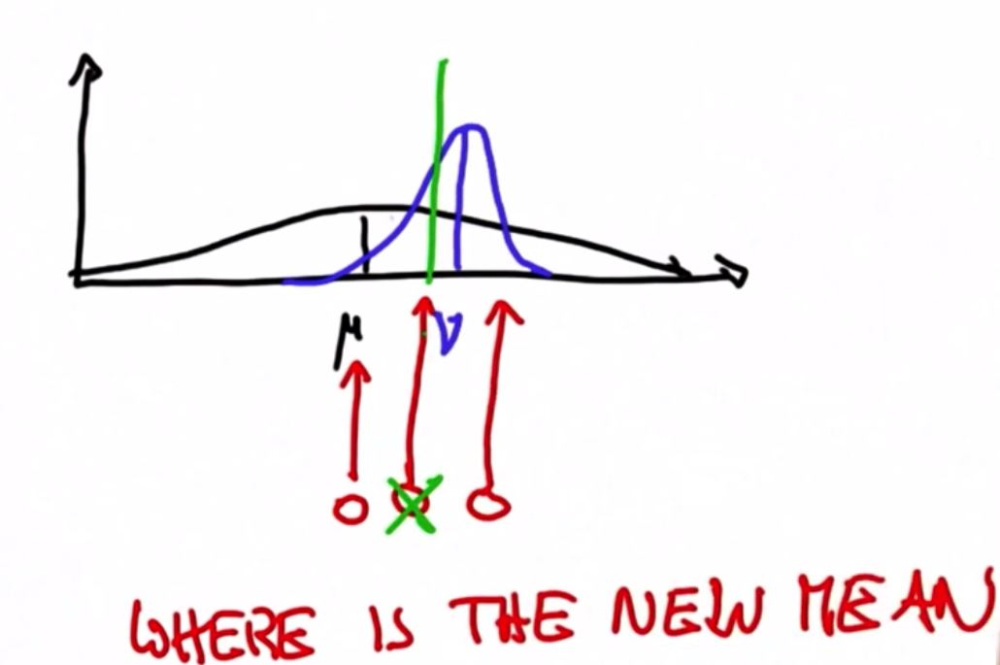

# Shifting The Mean

In Kalman Filters we iterate measurement update and motion (Also called predictions)

In the *measurement update* we will use Bayes Rule, which is nothing but a product (multiplication)

In the prediction we'll use total probability, which is a convolution, or simply an addition

***

The new mean can be found between the prior and the posterior

The new Gaussian created by finding the new mean between the prior and the measurement probability Gaussian distributions will be more certain than either of the two original Gaussian distributions, so it will be narrower

It becomes more certain because there is greater information gain with the two combined Gaussian distributions than we had when they were both on their own
