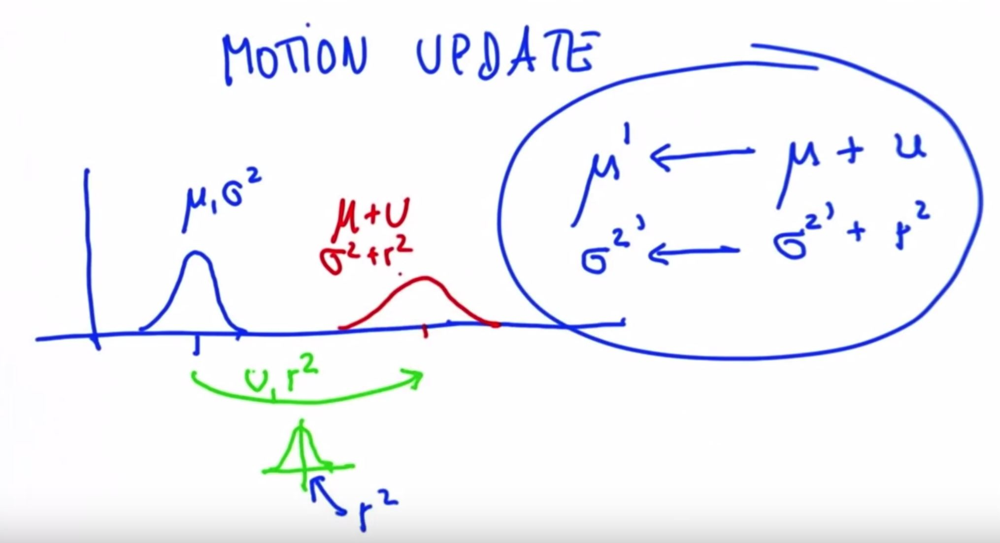

# Gaussian Motion Update (Also called prediction)



M prime = new mean

M = old mean

Sigma^2 prime = new mean variance

Sigma^2 = old mean variance

U = motion

r^2 = motion uncertainty

To get our new Gaussian after the motion from the original we only need to add perform two additions: (M + U) to get M prime, and (Sigma^2 + r^2) to get Sigma^2 prime

***

### Example

M = 8

U = 10

Sigma^2 = 4

r^2 = 6

Then M prime = 8 + 10 = 18

And Sigma^2 prime = 4 + 6 = 10

***

### Code

```python
# Write a program that will predict your new mean
# and variance given the mean and variance of your 
# prior belief and the mean and variance of your 
# motion. 

def update(mean1, var1, mean2, var2):
    new_mean = (var2 * mean1 + var1 * mean2) / (var1 + var2)
    new_var = 1/(1/var1 + 1/var2)
    return [new_mean, new_var]

def predict(mean1, var1, mean2, var2):
    new_mean = mean1 + mean2
    new_var = var1 + var2
    return [new_mean, new_var]

print predict(10., 4., 12., 4.)
```

The above program implements a 1-dimensional Kalman Filter

```python
# Write a program that will iteratively update and
# predict based on the location measurements 
# and inferred motions shown below. 

def update(mean1, var1, mean2, var2):
    new_mean = float(var2 * mean1 + var1 * mean2) / (var1 + var2)
    new_var = 1./(1./var1 + 1./var2)
    return [new_mean, new_var]

def predict(mean1, var1, mean2, var2):
    new_mean = mean1 + mean2
    new_var = var1 + var2
    return [new_mean, new_var]

measurements = [5., 6., 7., 9., 10.]
motion = [1., 1., 2., 1., 1.]
measurement_sig = 4.
motion_sig = 2.
mu = 0.
sig = 10000.

#Please print out ONLY the final values of the mean
#and the variance in a list [mu, sig]. 

# Insert code here
for n in range(len(measurements)):
    [mu, sig] = update(mu, sig, measurements[n], measurement_sig)
    print 'update', [mu, sig]
    [mu, sig] = predict(mu, sig, motion[n], motion_sig)
    print 'predict', [mu, sig]
```
