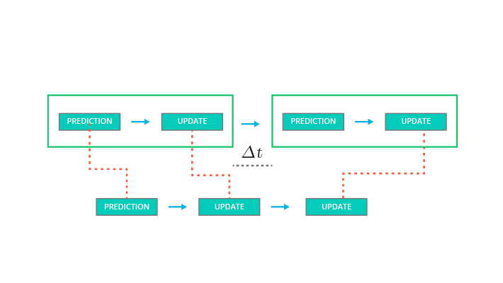

# Kalman Filter With Multiple Sensors

We want to track a pedestrian moving in font of our autonomous vehicle

At its core, the Kalman filter is a two-step estimation process: State prediction, and Measurement update. Predict & Update.

#### State Prediction

We start with what we know in the past about the pedestrian. We use that info to predict the state of the pedestrian until the next measurement arrives - this is called the predication step. 

#### Measurement Update

We use our new observations from the previous prediction step to correct our belief about the state of the pedestrian. 

###### The Kalman Filter simply consists of an endless loop of predict and update steps

***

### What happens when there are two sensors that observe the same pedestrian? How does that change the Kalman Filter?

We can keep the same process flow, but each sensor is going to have its own prediction/update scheme. In other words - the belief about the pedestrian's position and velocity is updated asynchronously each time the measurement is received regardless of the source sensor.

The prediction step is the same for both steps - but the measurement step is much different because a laser perceives the world in a Cartesian coordinate system while a radar perceives the world in a polar coordinate system. Thus, we have to use different measurement update functions specific to radar data.

If you receive two measurements simultaneously from different sensors, you can use this process with either measurement and then repeat the process with the other measurement. The order does not matter!

***

### Definition of Variables

- x is the mean state vector. For an extended Kalman filter, the mean state vector contains information about the object's position and velocity that you are tracking. It is called the "mean" state vector because position and velocity are represented by a gaussian distribution with mean x.
- P is the state covariance matrix, which contains information about the uncertainty of the object's position and velocity. You can think of it as containing standard deviations.
- k represents time steps. So x_k refers to the object's position and velocity vector at time k.
- The notation k+1∣k refers to the prediction step. At time k+1, you receive a sensor measurement. Before taking into account the sensor measurement to update your belief about the object's position and velocity, you predict where you think the object will be at time k+1. You can predict the position of the object at k+1 based on its position and velocity at time k. Hence x_(​k+1∣k) means that you have predicted where the object will be at k+1 but have not yet taken the sensor measurement into account.
- x_(​k+1) means that you have now predicted where the object will be at time k+1 and then used the sensor measurement to update the object's position and velocity

***

### Additional Info About Predict/Update

Because we have already run a prediction-update iteration with the first sensor at time k+3, the output of the second prediction at time k+3 will actually be identical to the output from the update step with the first sensor. So, in theory, you could skip the second prediction step and just run a prediction, update, update iteration.
