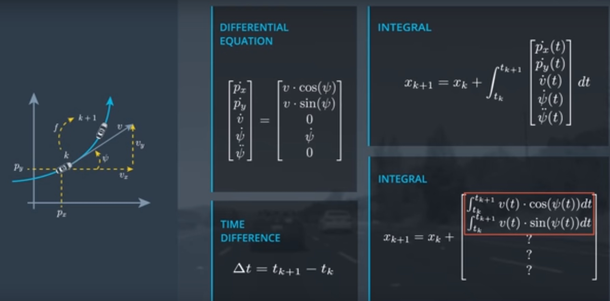

# CTRV Integral

Differential Equation:

```
[px_prime, py_prime, v_prime, yaw_angle, yaw_dot]

=

[v * cos(yaw_angle), v * sin(yaw_angle), 0, yaw_angle, 0]
```

Now we will explore how to get from time step **k** to time step **k+1**

***

Let's say that the discrete time step **k** relates to the continuous time value **tk**:

Time Difference:

```
t_delta = t_(k+1) - t_k
```

Then this state at time **k + 1** is given by the state of time **k** plus the integral over **x_dot** from time **tk** to time **tk + 1**. This 


