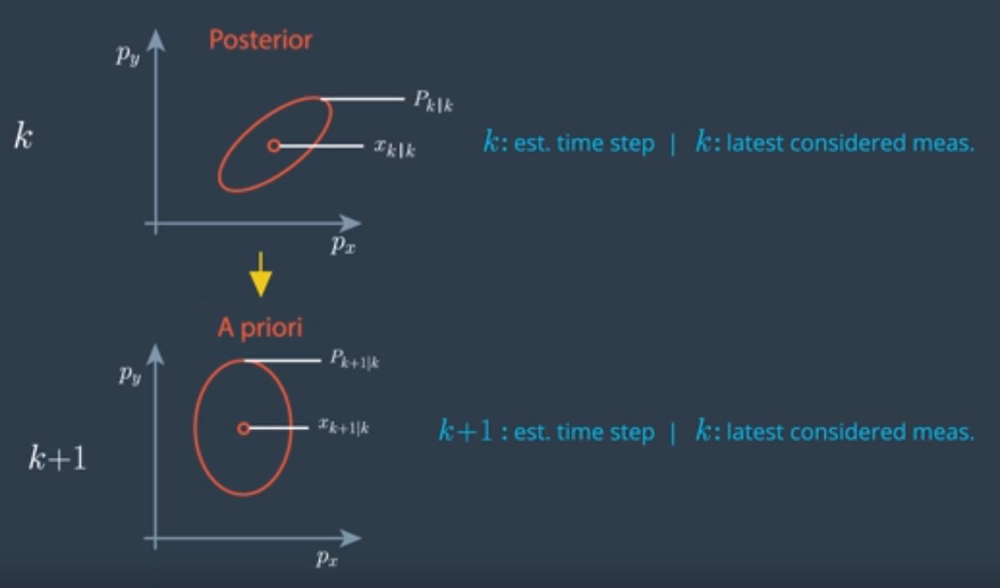

# What Problem Does The UKF Solve

To deal with nonlinear functions the UKF uses the unscented transformation

Given a state vector **x** and the state covariance **P** at time step **k**. What we want to do is predict the mean and the covariance to time step **k+1**. So we have **x_(k+1)|k** and **P_(k+1)|k**.

**k|k** means that the estimation is for time step **k** and the measurement at time **k** has already been taken into account. This is also called the **posterior estimation**.

**(k+1)|k** means that the estimation is for time **k+1** but the last measurement that has been taken into account was from **k**. This is what we have after the prediction, which is also called the **A priori estimation**.



The ellipses visualize the distribution of our uncertainty. All points on the outside ellipse's edge have the same probability density. If the uncertainty is normally distributed, these points have the shape of an ellipse. It is often called the error ellipse. It is the visualization of the covariance matrix **P**. 

If the process model is linear, the prediction model will look like:

```
Q = E{V_k * v_k}
```

**Q** is the covariance matrix of the process noise

We can use the Kalman filter to solve this linear prediction problem. What does this case look like if the process model is nonlinear? Then the prediction is defined by a nonlinear function **f**, as we have just derived it from the CTRV remodel.

Predicting with a nonlinear function provides a distribution which is generally not normally distributed anymore. However, the UKF keeps going as if the prediction was still normally distributed. This is not an analytical path anymore, it is an approximation.

What we want to find is the normal distribution that represents the real predicted distribution as close as possible. What we are looking for is the normal distribution that has the same mean value and covariance matrix as the real predicted distribution.

How do we find this mean vector and covariance matrix? This is what the unscented Kalman filter does
