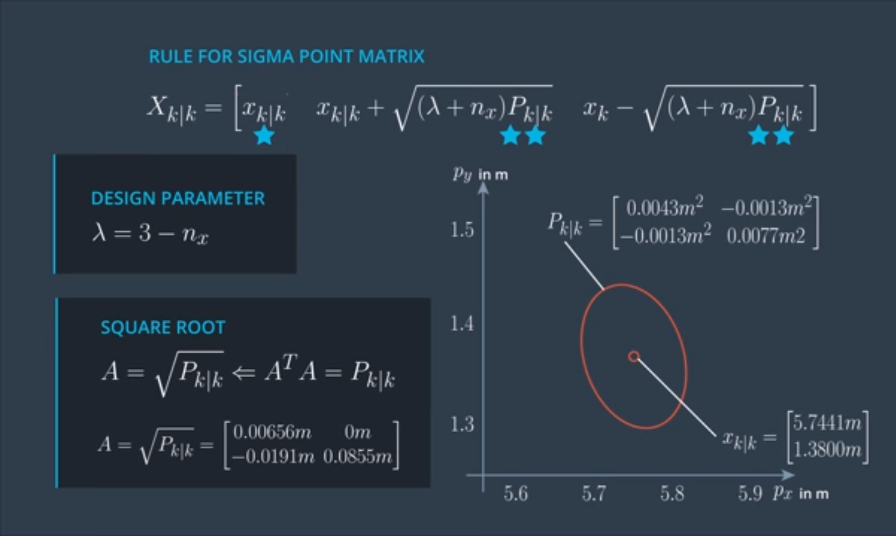

# Generating Sigma Points

We start at the beginning of the UKF processing chain, which means we are on the prediction step, and we want to generate sigma points. At the beginning of the prediction step we have the posterior state **x_k_k** and the posterior covariance matrix **P_k_k** from the last iteration. They represent the distribution of our current state. For this distribution, we want to generate sigma points.

The number of sigma points depends on the state dimension. This is the state vector of the CTRV model so the dimension of our state is **nx = 5**. We will chose **2n_x +1** sigma points. The first point is the mean of the state. Then we have another two points per state dimension which will be spread in different directions. To make things easier right now, we will consider only two dimensions of our state vector, the position **Px** and the position **Py**.

Now that our state dimension is two, we are only looking for five sigma points



***

### Code

main.cpp:

```c++
#include <iostream>
#include "Dense"
#include <vector>
#include "ukf.h"

using namespace std;
using Eigen::MatrixXd;
using Eigen::VectorXd;
using std::vector;

int main() {

    //Create a UKF instance
    UKF ukf;

/*******************************************************************************
* Programming assignment calls
*******************************************************************************/

    MatrixXd Xsig = MatrixXd(11, 5);
    ukf.GenerateSigmaPoints(&Xsig);

    //print result
    std::cout << "Xsig = " << std::endl << Xsig << std::endl;

    return 0;
}
```

ukf.cpp:

```c++
#include <iostream>
#include "ukf.h"

UKF::UKF() {
  //TODO Auto-generated constructor stub
  Init();
}

UKF::~UKF() {
  //TODO Auto-generated destructor stub
}

void UKF::Init() {

}

/*******************************************************************************
* Programming assignment functions: 
*******************************************************************************/


void UKF::GenerateSigmaPoints(MatrixXd* Xsig_out) {

  //set state dimension
  int n_x = 5;

  //define spreading parameter
  double lambda = 3 - n_x;

  //set example state
  VectorXd x = VectorXd(n_x);
  x <<   5.7441,
         1.3800,
         2.2049,
         0.5015,
         0.3528;

  //set example covariance matrix
  MatrixXd P = MatrixXd(n_x, n_x);
  P <<     0.0043,   -0.0013,    0.0030,   -0.0022,   -0.0020,
          -0.0013,    0.0077,    0.0011,    0.0071,    0.0060,
           0.0030,    0.0011,    0.0054,    0.0007,    0.0008,
          -0.0022,    0.0071,    0.0007,    0.0098,    0.0100,
          -0.0020,    0.0060,    0.0008,    0.0100,    0.0123;

  //create sigma point matrix
  MatrixXd Xsig = MatrixXd(n_x, 2 * n_x + 1);

  //calculate square root of P
  MatrixXd A = P.llt().matrixL();

/*******************************************************************************
 * Student part begin
 ******************************************************************************/

  //set first column of sigma point matrix
  Xsig.col(0)  = x;

  //set remaining sigma points
  for (int i = 0; i < n_x; i++)
  {
    Xsig.col(i+1)     = x + sqrt(lambda+n_x) * A.col(i);
    Xsig.col(i+1+n_x) = x - sqrt(lambda+n_x) * A.col(i);
  }

/*******************************************************************************
 * Student part end
 ******************************************************************************/

  //print result
  //std::cout << "Xsig = " << std::endl << Xsig << std::endl;

  //write result
  *Xsig_out = Xsig;

/* expected result:
   Xsig =
    5.7441  5.85768   5.7441   5.7441   5.7441   5.7441  5.63052   5.7441   5.7441   5.7441   5.7441
      1.38  1.34566  1.52806     1.38     1.38     1.38  1.41434  1.23194     1.38     1.38     1.38
    2.2049  2.28414  2.24557  2.29582   2.2049   2.2049  2.12566  2.16423  2.11398   2.2049   2.2049
    0.5015  0.44339 0.631886 0.516923 0.595227   0.5015  0.55961 0.371114 0.486077 0.407773   0.5015
    0.3528 0.299973 0.462123 0.376339  0.48417 0.418721 0.405627 0.243477 0.329261  0.22143 0.286879
*/
}
```

ukf.h:

```c++
#ifndef UKF_H
#define UKF_H
#include "Dense"
#include <vector>

using Eigen::MatrixXd;
using Eigen::VectorXd;

class UKF {
public:


  /**
     * Constructor
     */
    UKF();

    /**
     * Destructor
     */
    virtual ~UKF();

    /**
     * Init Initializes Unscented Kalman filter
     */
    void Init();

  /**
   * Student assignment functions
   */
  void GenerateSigmaPoints(MatrixXd* Xsig_out);
  void AugmentedSigmaPoints(MatrixXd* Xsig_out);
  void SigmaPointPrediction(MatrixXd* Xsig_out);
  void PredictMeanAndCovariance(VectorXd* x_pred, MatrixXd* P_pred);
  void PredictRadarMeasurement(VectorXd* z_out, MatrixXd* S_out);
  void UpdateState(VectorXd* x_out, MatrixXd* P_out);

};

#endif /* UKF_H */
```

Now we know how to represent the uncertainty of the posterior state estimation with sigma points
