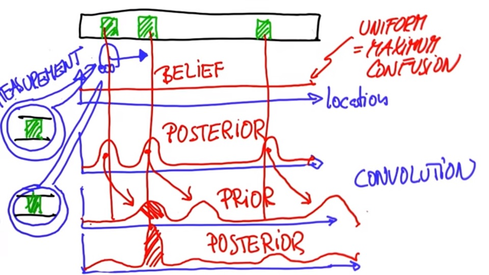

# Total Probability

Let's assume that we have a world and a robot in our world that has no idea where it is. We can model this with a function where the vertical axis is the probability for any location in this world, and the horizontal axis corresponds to all the places in this 1D world. The way we model the robot's current belief about where it might be - it's confusion - is by a uniform function that assigns equal weight to every possible place in this world. This is the state of maximum confusion.

Now, to localize the world has to have some distinctive features. Let's assume there is three different landmarks in the world. There is a door near the beginning of our 1D world, another door next to that one, and then another door near the end of our 1D world. Let's assume all the doors look the same, but you can distinguish a door from the non-door area that is just a wall.

Let's say that our robot senses that it is right next to a door. The measurement of a door *transforms our belief function* defined over possible locations, to a new function that looks like this:


This new function seen above is know as the **Posterior Belief**, meaning our belief after measurement has been taken. The key aspect of this belief is that we still don't know where we are. There are three possible door locations - and even knowing this, the sensors could be erroneous and we accidentally saw a door where there isn't one. However, the three bumps together express our current best belief of where we are.

Now let's assume that the robot moves to the right by a certain distance. Now we can shift the belief according to the motion. Our Posterior with also shift right, but we will lose some of our certainty (The bumps will be smaller) because we moved without sensing our new area. The process of moving these beliefs to the right is called a **convolution**.

Let's assume that our robot then moves again and sees itself to the right next to a door again, so the measurement is the same as before. Now we multiply our belief - which is now prior to the second measurement - with a function that looks very much like this:



There are a couple of minor bumps but the only big bump corresponds to the first bump in our prior (the middle function). All the other places of doors have a low prior belief. The car is now fairly sure that it is at the second door since it can compare the previous readings.

***

### Generalized Uniform Distribution

```python
#  Modify your code to create probability vectors, p, of arbitrary 
#  size, n. Use n=5 to verify that your new solution matches 
#  the previous one.

p=[]
n=5

for i in range(n):
    p.append(1./n)

print p
```
