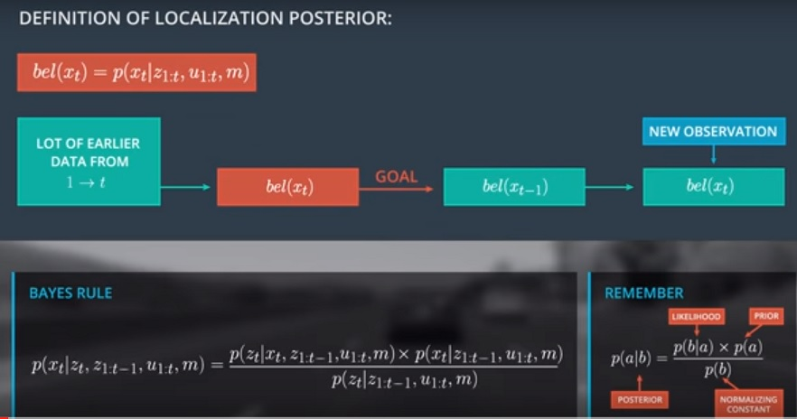

# Bayes Rule & Law Of Total Probability



In the bottom-left corner of the above image you can see the resut of applying Bayes rule for the localization posterior. To define the likelihood term we swap the state and the observation at **t** and also take into account all other conditions. The prior and the normalizer are also conditioned by the previous observations, all controls, and the map. It is fine to condition Bayes rule on arbitrary variables like the controls, like our observations, and the map.

If you remove the additional conditions in the posterior you would end up exactly with the general Bayes formula. We call the likelihood terms observation model, which describes the probability distribution of the observation vector **t**. Another assumption, that the state **x_t**, all the previous observations, all controls, and the map are given.

The prior is called the motion model. It is a probability distribution of **x_t**, given all observations from 1 to **t - 1**, all controls, and the map. Take into account that no current observations are included in the motion model. To simplify the normalization part, we defined the normalizer as **eta**. **Eta** is 1 over the original normalization term, and this term is a sum of the products of the observation and the motion model over all possible states **x_t_i**. This also means you only have to define the observation and motion model to estimate the beliefs.

***

### Definition Of Motion Model

```
p(x_t|z_1:t-1, u_1:t, m)
```

The problem with this definition is that we have no information where the car was before at time **t - 1**. This means no information about the previous state **x_(t-1)**. What kind of rule or law can we use which will help us here?
