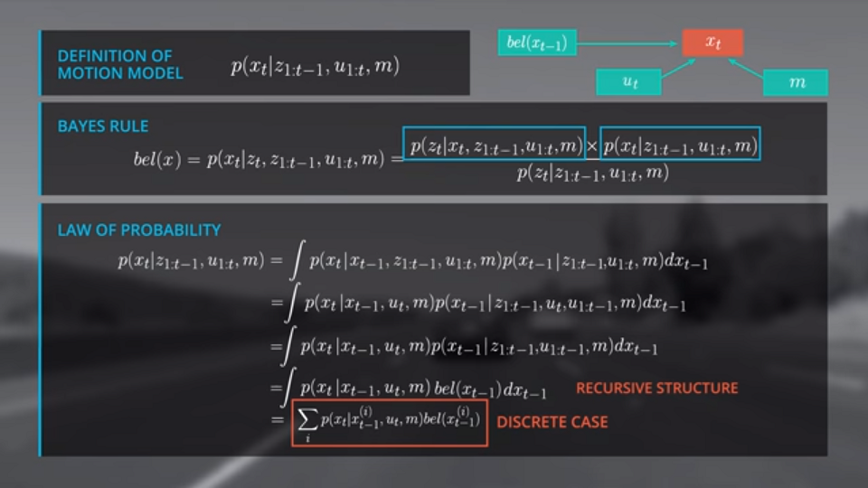
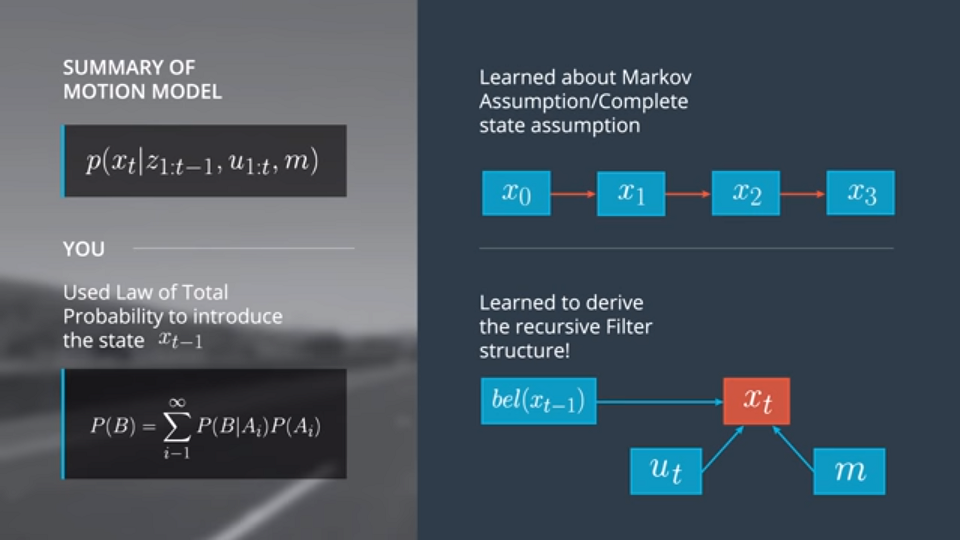

# Recursive Structure

First, we rewrite the second term of the integral function: **p(x_(t-1)|z_(1:t-1), u_(1:t-1), m)** to be **p(x_(t-1)|z_(t-1), z_(1:t-2), u_(1:t-1), m)**. Then we can compare this with the Bayes rule formula from the beginning: **p(x_t|z_t, z_1:t-1, u_1:t, m)** and you will see that the **u_1:t** term is the belief from the previous time step, **t-1**. Now we can rewrite the integral with a belief **x_t-1** inside. We now have a recursive update formula: **Integral(p(x_t|x_t-1, u_t, m)bel(x_t-1)d_x_t-1)**. We use the estimated state from the previous time step for the prediction of the current one. We are independent from the whole observation and control history.

To review:

