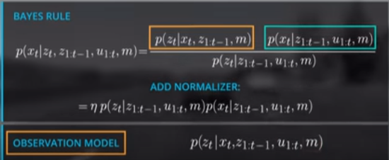
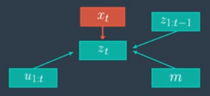

# Observation Model Intro

The observation model describes the probability distribution of the observation set **t** given: the state **x_t**, our previous observations, our controls, and the map. We can also represent the relationship as a diagram or graph like this:

**x_t** is unknown and points to **set t**, as well as all other values like the controls, the map, and the previous observations

***

What “trick” can we use there, which helps us to manipulate/simplify the observation model?

#### We can use the Markov Assumption here to simplify the observation model
