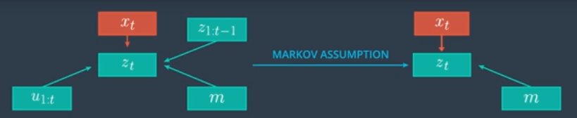
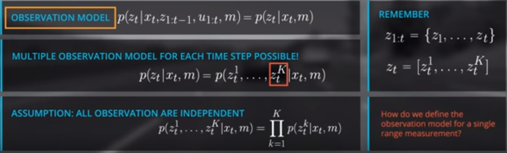
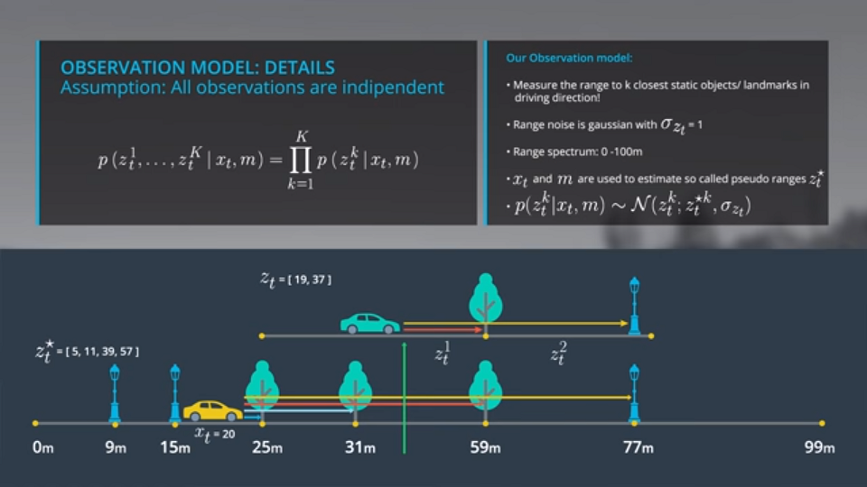

# Markov Assumption For Observation

Since we assume that we know the **x_t** in the Bayes Rule, it doesn't really matter what the car observes, and how it moves before **x_t**. These values were already used to estimate **x_t**, and that **t** would not benefit from these values. This means we assume that this **t** is independent of our previous observations and the controls. This is an example of the use of the Markov assumption. We can simplify our posterior distribution to **p(z_t|x_t, m)** in the observation model. Let's take a closer look at this observation model:

**t** is, or could be a vector of multiple observations. This means we rewrite the observation model in this way:

We assume that the noise behavior of the individual range values, **z_t1** to **z_t_k** is independent. This also means that all observations are independent, and allows us to represent the observation model as a product over the individual probability distributions of each single range measurement. How should we define the observation model forcing a range measurement?

In general there are a lot of different observation models because we have a lot of different sensors like lidars, cameras, radars, or ultrasonic sensors. Each sensor has a specific noise behavior and performance. The observation model also depends on the type of the map. You can have dense 2D or 3D grid maps, or sparse feature-based maps. In our 1D examples we assume that our sensor measures the range to the **n** closest objects in driving direction. The objects detected represent the objects in our map. We assume the observation noise can be modeled as a Gaussian with a standard deviation of 1 meter. We also assume that our sensor can measure in a range between 0 and 100 meters.

To implement the observation model, you use a given state **x_t** and the given map to estimate so-called pseudo ranges. These pseudo ranges represent the true range values and the assumption your car would stand at the specific position **x_t** in the map. For example, assume your car is standing here at position 20 and would observe 5 meters to the first, 11 meters to the second, 39 meters to the third, and 59 meters to the last landmark. The observation would fit to a position around 40. Based on this the observation model for a single range measurement as defined by the probability of the following normal distribution, defined by the mean that is **t_k** and our sigma. These insights allows us to implement the observation model in C++.

