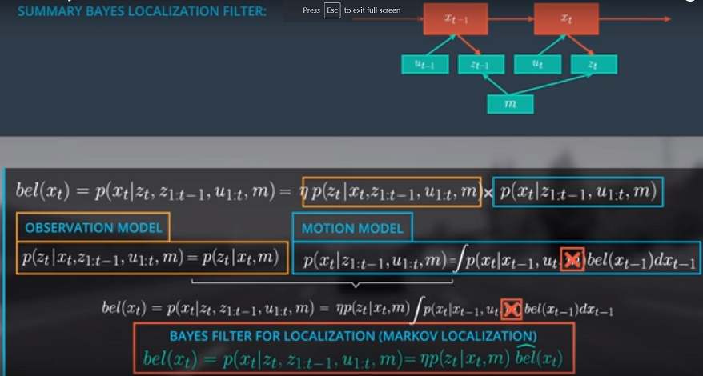

# Finalize The Bayes Localization Filter

We started this unit by learning the Bayes rule: The belief of **x_t** as a normalizer **eta**, multiplied by the observation and the motion. We simplified the observation model to **p(z_t|x_t, m)** using the Markov assumption. For the motion model, we used the law of total probability, and also the Markov assumption to get the desired recursive structure. The motion model includes the belief at **t-1** and our transition model. Finally, the belief at **x_t** can be written as the formula below the observation and motion model in the picture. The motion model is also called the prediction step for the belief **x_t** which can be expressed by the belief **x_t** with a hat. This formula represents a general Bayes filter for localization, and is also called Markov localization.

You can also represent the filter dependencies as a graph by combining both sub-graphs. To estimate the new state **x_t** we only take into account the previous belief state, and only the current observation and controls. The state **x_t** and **z_t** also depend on the map. It is also common practice to remove the map **m** from the motion model. 

