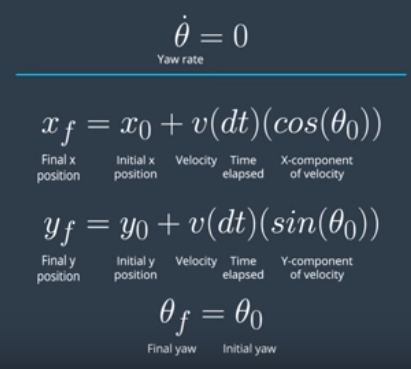
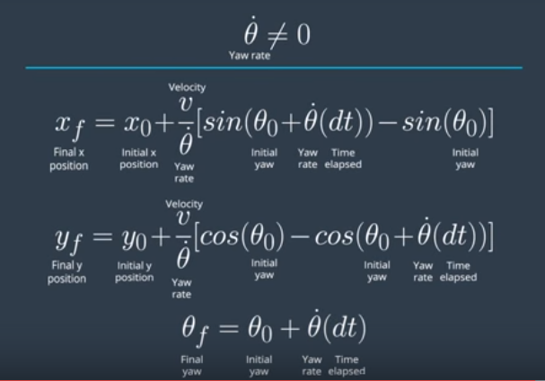

# Yaw Rate & Velocity

To recap on the sensor fusion lesson, a car's heading (**yaw angle**) is its orientation. **Yaw** is often measured from the x-axis in map coordinates with counterclockwise angles being positive. Assuming constant turn rate and velocity, the equations to find the new position of the car, which you derived previously in the fusion section, are shown again here:

This set of equations are valid when the **yaw rate** (theta dot) is equal to 0. Here, **x_f**, **y_f**, and **theta_f** represent the final **x** position, **y** position, and **yaw** of the car, while **x_0**, **y_0**, and **theta_0** represent the initial **x** position, **y** position, and **yaw** of the car. Finally, **v** is the velocity of the car, and **dt** is the time elapsed. If the **yaw rate** is not 0, you have these equations instead:

We will have to take into account the change in the car's heading as it moves
