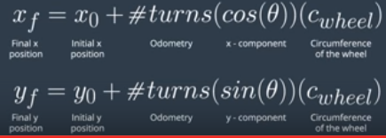

# Odometry

Now that we know one way to calculate the car's new position, we will look at another commonly used method using odometry, or motion sensor data

For mobile robots, odometry comes from wheel sensors that measure how many times the wheels of the vehicle have turned. We can use this to determine the distance traveled. More specifically, the new position of the car is the starting position of the car, plus the **x** and **y** components of the odometry, multiplied by the circumference of the wheel.

