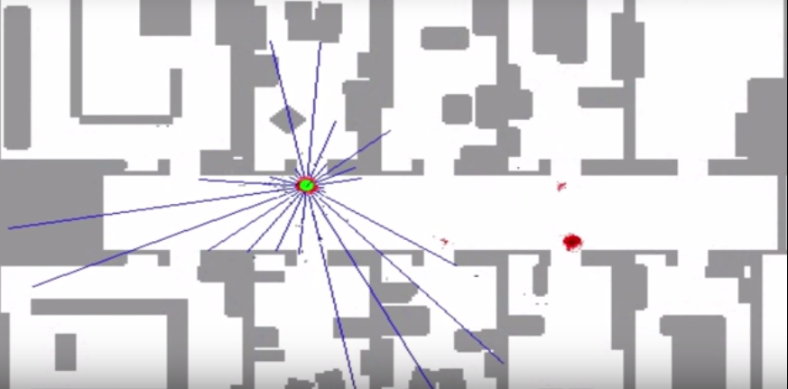

# Particles

Each of the red dots in the image is a discrete guess where the robot might be in this map. It is structured as an x-coordinate, a y-coordinate, and also a heading direction. These three values together comprise a single guess, but a single guess is not a filter. It is the set of several thousand such guesses that together comprise an approximate representation for the posterior of the robot. Initially, since we know nothing about the location of the robot, the dots are uniformly distributed across the entire map.

The particle filter lets certain particles survive in proportion of how consistent 1 of these particles is with sensor measurement. Very quickly, the robot figured out that it is in the corridor, but two clouds survive because of the symmetry of the corridor. When the robot enters one of the offices the symmetry is broken and the correct set of particles survive.
