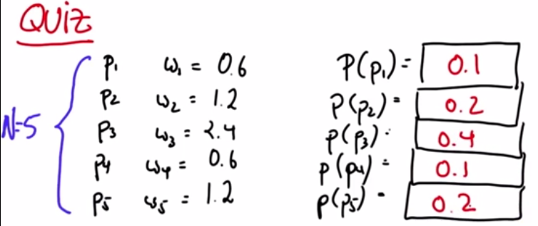

# Never Sampled

In the random sampling process something with an importance weight of 0.1 is actually unlikely to be sampled into the next data set.

#### What is the probability of never sampling **p3**?

The probability of not sampling **p3** in one sampling is 0.6 but we will sample 5 times so this means we can find the probability by doing 0.6^5 which equals **0.0777**.
