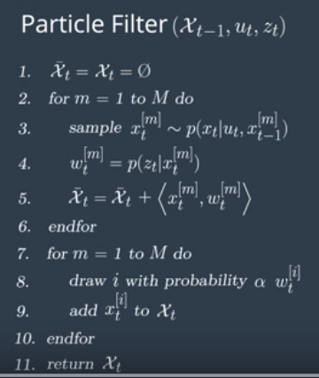

# Pseudocode For Particle Filter

The first line of pseudocode is the initialization step for the filter

The third line represents the prediction step of the filter, which is analogous to the prediction step of the Bayes filter we studied before. Here we will add the control input to all of the particles.

The fourth and fifth lines are part of the update step where we will update each particle's weight

The second for loop seen in lines 7-10 is the resampling step

Lastly, in line 11, once the resampling is done, the new set of particles represents the Bayes filter posterior

Above is a flow chart representing the particle filter algorithm from the pseudocode we saw previously
