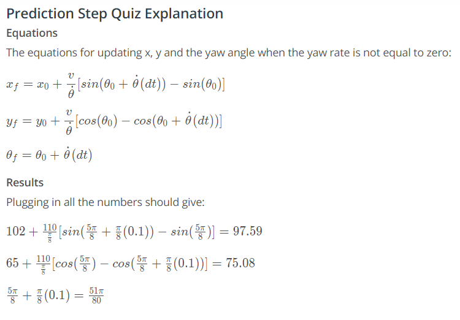

# Prediction Step

The next part of the filter we need to implement is the prediction step. For the prediction step we will use a motion model to predict where the car will be at the next time step. For each particle, you will have to update the particle's location based on **velocity** and **yaw rate** measurements. To account for the uncertainty in the control input, in the project we will add Gaussian noise to the **velocity** and **yaw rate**.

Now we will calculate the prediction of a car
s position, assuming a bicycle motion model and disregarding sensor uncertainty for now

#### Given the car’s last position was at (102 m, 65 m) with a heading of (5pi)/8 radians, the car’s velocity was 110 m / s, and the car’s yaw rate was pi/8 rad / s over the last 0.1 seconds, what is the car’s new position and heading?

(x, y, theta) = (97.59, 75.08, (51*pi)/80)

