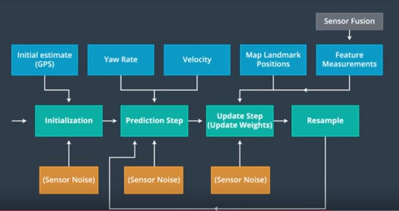

# Data Association: Nearest Neighbor Effectiveness

Before we can use landmark measurements of the objects around us to update the belief of our position, we'll have to solve the data association problem. Data association is the problem of matching landmark measurements to objects in the real world, like map landmarks.

Lets say one of your landmarks is a house and your car senses the house twice. The first time it senses only the front of the house, and the second time is senses only the back of the house. Ideally, you would want it to sense the middle of the house to get the best prediction, so your two predictions are both wrong in this case by some margin. How do we solve this problem?

For the self-driving car with landmarks, often you have some map landmarks that have multiple lidar measurements that could correspond to it. To pick the right correspondents, we can use a very simple technique called **nearest neighbor**. In this method, simply take the closest measurement as a correct correspondents, like the map landmark and lidar measurement.

#### Which of the following characteristics of the input data would help nearest neighbor data association become more effective?

- High signal-to-noise ratio for sensors
- A very accurate motion model

***

### Nearest Neighbor Advantages

Pros:

- Easy to understand and implement
- Works in many situations

Cons:

- Not as robust to difficult scenarios (Like if we have a high density of measurements)
- Inefficient because for each landmark you have to search through all of the measurements to find the one with the minimum distance **O(m*n)** complexity where **m** is the number of map landmarks and **n** is the number of sensor measurements. If there are a lot of sensor measurements, or landmarks, nearest neighbor could become slow. 
- If a sensor is very noisy, you could easily match a spurious feature, one that doesn't actually correspond to any object in the real world to a map landmark. 
- Not as robust to errors in the vehicle position estimate, If the vehicle position has some errors, nearest neighbor will also have errors.
- Does not take uncertainties of the sensor into account
