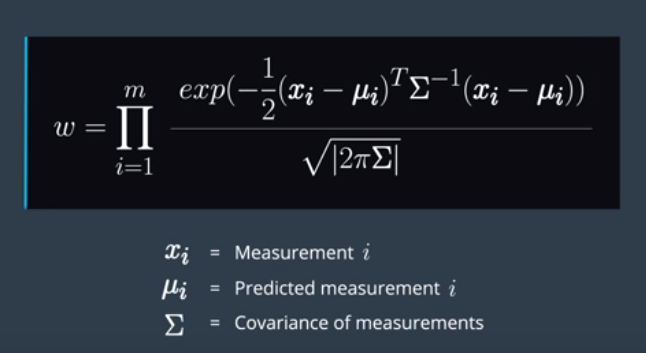
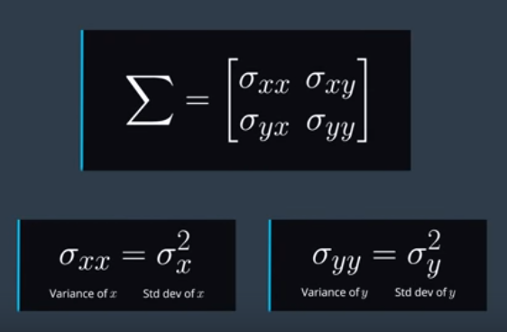

# Update Step

WE know how to incorporate **velocity** and **yaw rate** measurements into the particle filter. What about sensor measurements, such as readings from radar or lidar? These landmark measurements will be used to compute the update step which we saw before in the Bayesian filter. Instead of the feature measurements directly affecting the prediction of the state of the car, the measurements will instead inform the weight of each particle. The size of each particle in this visualization correlates with its weight. 

One way to update the weights of the particles is to use the multivariate Gaussian probability density function for each measurement and combine the likelihoods of all the measurements by taking their product. This function tells us how likely a set of landmark measurements is given our predicted state of the car and the assumption that the sensors have Gaussian noise. We also assume each landmark measurement is independent, so we will take the product of the likelihoods over all measurements.

Here, **x_i** represents the **i**th landmark measurement for one particular particle. **mu_i** represents the predicted measurement for the map landmark corresponding to the **i**th measurement. **m** is the total number of measurements for one particle. Finally, **sigma** is the covariance of the measurement. The covariance matrix **sigma** is a symmetric square matrix that contains the variance, or uncertainty, of each variable in the sensor measurement, as well as the covariance, or correlation, between these variables.

***

In the case of lidar, the variables in question would be the **x** and **y** position of the landmark and vehicle coordinates

The diagonal terms of the covariance matrix are the variance of each variable, which is the standard deviation of the variable squared. As the **x** variance term increases, the uncertainty in the **x** direction also increases. Note that feature measurements are usually given in vehicle coordinates, where the **x**-axis points in the direction of the car's heading and the **y**-axis points to the left of the car. Similarly, as the **y** variance term increases, the uncertainty in the **y** direction also increases. You can think of the covariance matrix as an inverse matrix of weights. The smaller the diagonal term for a certain variable, the more you can trust this variable in the measurement and the higher the weight we can put on it. 

The off diagonal terms of the covariance matrix represent the correlation between the two variables. For instance, it **x** increases as **y** increases, you could represent that in the off diagonal terms of this matrix. For the project we will assume the different variables in the sensor measurement are independent, and therefore the off diagonal terms are 0. However, this is often not the case in practice.

After we update the weights for each particle, we have to resample the particles with probability proportional to these weights
