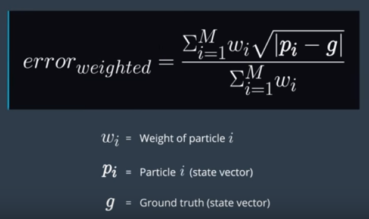
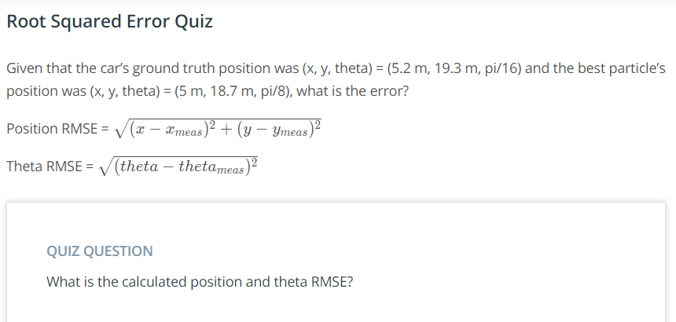

# Calculating Error

Once we finish implementing the particle filter we have to assess how accurate our position estimates were. We are provided the ground truths of the car in the project, so we can compare that with our measurement data. There are two different ways to quantify the difference between your results and the ground truth. 

1. We could report our error by taking the weighted average error of all the particles. To do this we can simply take the root squared error between each particle and ground truth, and multiply it by the particle's weight. In this equation, **P_i** and **g** are vectors that contain the **x**, **y**, and **yaw** of the car in map coordinates. Then we have to divide by the sum of the weights.
2. Another possibility is to just look at the best, or the highest-weighted particle, and simply take the root squared error of this particle.

### Error Quiz

RMSE(x, y) = (.63, RMSE(theta) = pi/16)
