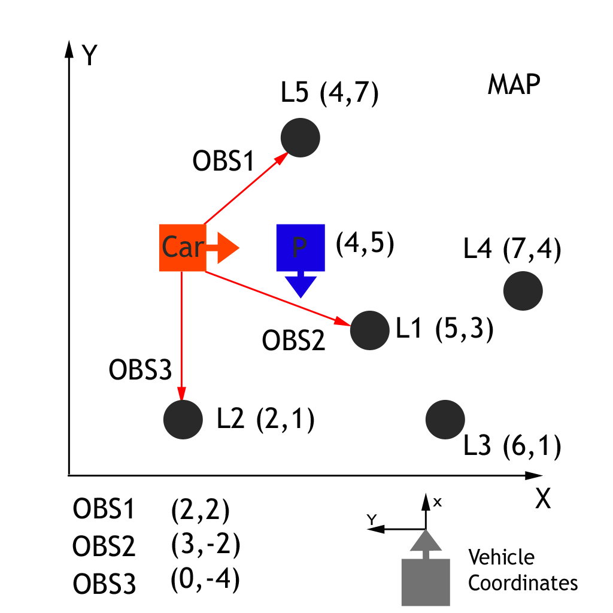
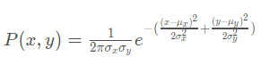

# Transformations & Associations

In the project you will need to correctly perform observation measurement transformations, along with identifying measurement landmark associations in order to correctly calculate each particle's weight. Remember our ultimate goal is to find a weight parameter for each particle that represents how well that particle fits to being in the same location as the actual car.

In this exercise we will be given a single particle with its position and heading along with the cars observation measurements. We will first need to transform the car's measurements from its local car coordinate system to the map's coordinate system. Next each measurement will need to be associated with a landmark identifier, for doing this part we will simply take the closest landmark to each transformed observation. Finally we will then have everything we need to calculate the particles weight value.

Map with Car Observations & Particle

In the graph above we have a car that observes three nearby landmarks, each one labeled OBS1, OBS2, OBS3. Each observation measurement has x, and y values in the car's coordinate system. We have a particle "P" above with position (4,5) on the map with heading -90 degrees. The first task is to transform each observation marker from the vehicle's coordinates to the map's coordinates, in respect to our particle.

#### Transformation for OBS1

What is the (x,y) measurement transformation for OBS1?

#### Transformation for OBS2

What is the (x,y) measurement transformation for OBS2?

#### Transformation for OBS3

What is the (x,y) measurement transformation for OBS3?

### Transformations

In general there is a single function that given any particle position and heading along with any observation measurement (x,y) will output the transformed observation (X,Y) for that particle. Hint: its derived using Trig.

**Transformed Observation (X,Y)** (particle x, particle y, particle heading, observation x, observation y)

You will need to derive and use this function to efficiently calculate particle observation transformations in the project.

### Associations

After the observations have been transformed into the map's coordinate space, the next step is to associate each transformed observation with a land mark identifier. In the map exercise above we have 5 total landmarks each identified as L1, L2, L3, L4, L5, and each with a known map location. We need to associate each transformed observation TOBS1, TOBS2, TOBS3 with one of these 5 identifiers. To do this we simply associate the closest landmark to each transformed observation.

#### TOBS1 Association

Which landmark identifier is transformed OBS1 associated with? **L1**

#### TOBS2 Association

Which landmark identifier is transformed OBS2 associated with? **L2**

#### TOBS3 Association

Which landmark identifier is transformed OBS3 associated with? **L5**

### Calculating the Particle's Final Weight

Now we that we have done the measurement transformations and associations, we have all the pieces we need to calculate the particle's final weight. The particles final weight will be calculated as the product of each measurement's Multivariate-Gaussian probability.

The Multivariate-Gaussian probability has two dimensions, x and y. The mean of the Multivariate-Gaussian is the measurement's associated landmark position and the Multivariate-Gaussian's standard deviation is described by our initial uncertainty in the x and y ranges. The Multivariate-Gaussian is evaluated at the point of the transformed measurement's position. The formula for the Multivariate-Gaussian can be seen below.

### Particle's Final Weight

To get the final weight just multiply all the calculated measurement probabilities together

#### Particle's Final weight

What is the particle's final weight? Write your answer in scientific notation with an accuracy of two decimal places, for example 3.14E-15.
