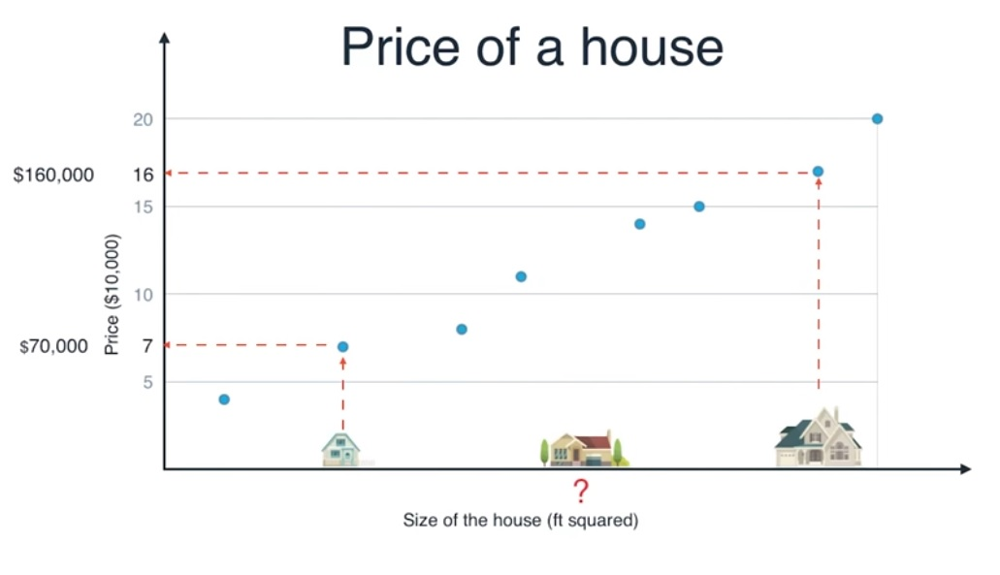
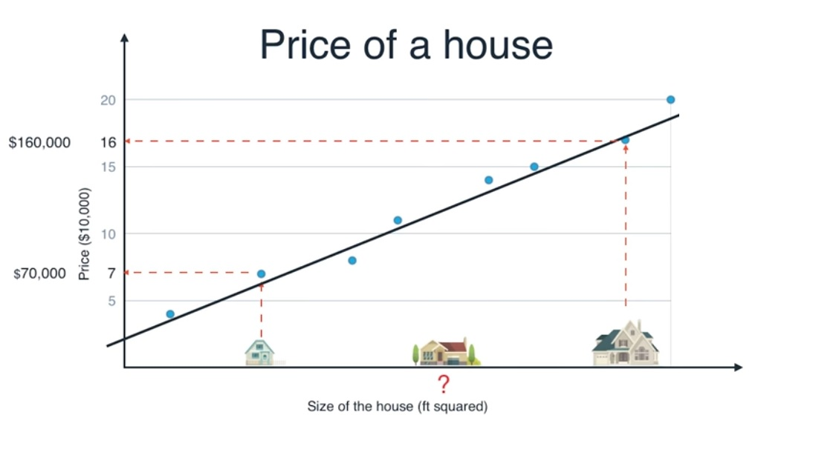

#Linear Regression

Given a scatterplot of data we can use linear regression to estimate the location of points based on other points

Take this graph for example:

We can see that a small house is worth $70,000 and a large house is worth $160,000

We can also see other houses represented on the graph as points

Using this information we can draw a line through the graph to represent the average price of a house based on its size at any given location in the graph:

Using this line we can make a good guess at how much the medium house is worth. Probably around $120,000.

This process where we determine one point based on others is called **Linear Regression**, and we can make programs that can do these types of estimates for us
