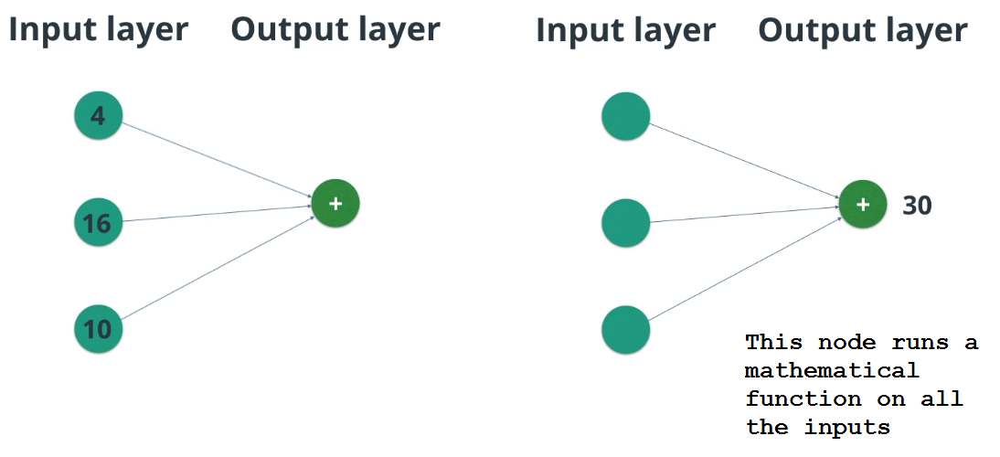

#Neural Network Graphs

A neural network is a graph of mathematical functions such as linear combinations and activation functions. The graph consists of nodes, and edges.

Nodes in each layer (except for nodes in the input layer) perform mathematical functions using inputs from nodes in the previous layers. For example, a node could represent f(x,y)=x+y, where x and y are input values from nodes in the previous layer.

Similarly, each node creates an output value which may be passed to nodes in the next layer. The output value from the output layer does not get passed to a future layer (last layer!)

Layers between the input layer and the output layer are called hidden layers.

***

###Forward Propagation

By propagating values from the first layer (the input layer) through all the mathematical functions represented by each node, the network outputs a value. This process is called a **forward pass**.

Notice that the output layer performs a mathematical function, addition, on its inputs. There is no hidden layer.

***

###Graphs

The nodes and edges create a graph structure. Though the example above is fairly simple, it isn't hard to imagine that increasingly complex graphs can calculate almost anything.

There are generally two steps to create neural networks:

1. Define the graph of nodes and edges.
2. Propagate values through the graph.

MiniFlow works the same way. You'll define the nodes and edges of your network with one method and then propagate values through the graph with another method. MiniFlow comes with some starter code to help you out. Let's take a look.
