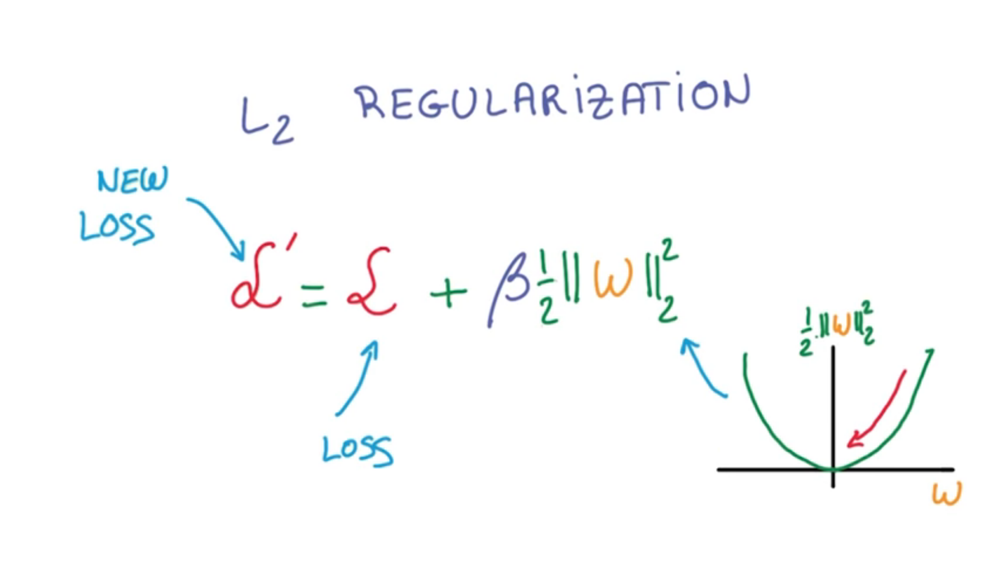

# Regularization

Why did we not discuss deep models earlier? Many reasons, but mostly because deep models are only effective if you have enough data to train them. Also, because we now know how to train very big models using **regularization techniques**. 

There is a general issue when you are doing numerical optimization called the **skinny jeans problem**. Skinny jeans look great, they fit perfect, but they're really hard to get in to. Most people end up getting into jeans that are just a bit too big. **It's the exact same with deep neural networks**. The network that is just the right size for your data is very hard to optimize. So in practice, we always try networks that are way too big for our data and then we try our best to prevent them from overfitting.

***

### Early Termination

The first way we prevent overfitting is by looking at the performance under the validation set, and stopping to train as soon as we stop improving. This is called **early termination**, and it is still the best way to prevent your network from over-optimizing on the training set. 

***

### Regularization

You can also prevent overfitting by applying regularization. Regularizing means applying artificial constraints on your network that implicitly reduce the number of free parameters while not making it more difficult to optimize.

In **L2 Regularization**, the idea is to add another term to the loss, which penalizes large weights. It is typically achieved by adding the L2 norm of your weights to the loss, multiplied by a small constant. 

The nice thing about L2 regularization is that it is very simple. Since you just add it to your loss, the structure of your network doesn't have to change. You can even compute its derivative by hand. The L2 norm stands for the sum of the squares of the individual elements in a vector.
