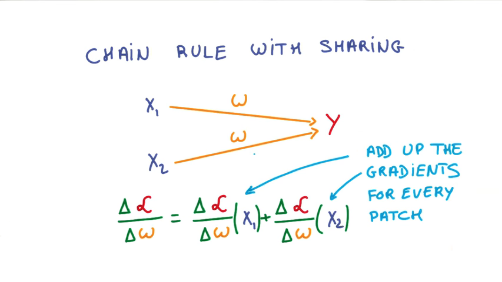

# Convolutions Continued

You can build a simple covnet by:

Stacking up your convolutions, which thankfully you don't have to implement yourself

Then use trieds to reduce the dimensional ID and increase the depth of your network layer after layer

Once you have a deep and narrow representation, connect the whole thing to a few fully connected layers and you are ready to train your classifier

You might wonder what happens to training, and to the chain rule in particular, when you use shared weights like this. But the math actually takes care of everything for you. You just add up all the derivatives from all of the possible locations on the image. 

