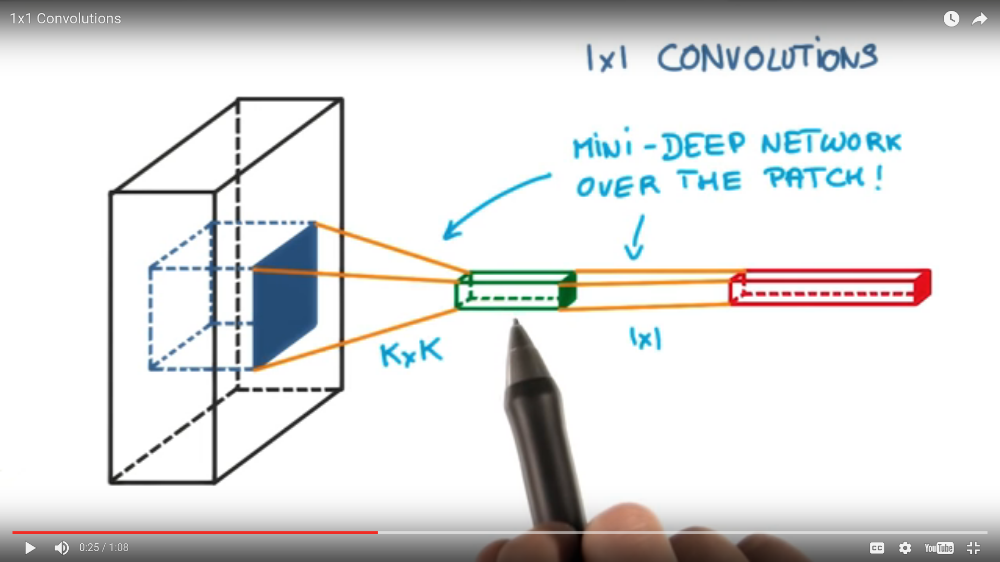

# 1x1 Convolutions

Why would you want to ever use a 1x1 convolution? They don't look at a patch of the image, just one pixel. Look at the classic convolution setting:

It's basically a small classifier for a patch of the image, but it's only a linear classifier. If you add a 1x1 convolution in the middle:

Suddenly you have a mini neural network running over the patch instead of a linear classifier. Interspersing your convolutions with a 1x1 convolutions is a very inexpensive way to make your models deeper and have more parameters without completely changing their structures. They are also very cheap because, if you go through the math, they're not really convolutions at all. They are really just matrix multiplies and they have relatively few parameters.
