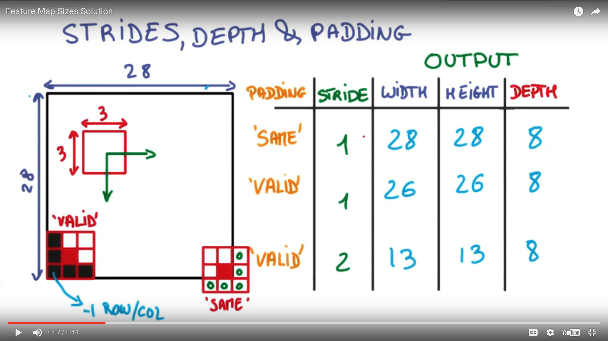

# Quiz: Feature Map Sizes



If you are using *same padding* and a *stride of 1* then the output width and height are the same as the input. We just add zeros to the input image to make the sizes match. 

If you used *valid padding* and a *stride of 1*, then there is no padding at all. So if you want to fir your small filter on the input image without doing any padding, you're going to remove one row and one column of the image on each side, leaving you with a 26x26 output.

If you used *valid padding* and a *stride of 2*, then you only get half as many outputs as *valid padding* with a *stride of 1*. 

In all cases the output depth isn't changed

#### SAME padding equation:

```
out_height = ceil(float(in_height) / float(strides[1]))
out_width  = ceil(float(in_width) / float(strides[2]))
```

#### VALID padding equation:

```
out_height = ceil(float(in_height - filter_height + 1) / float(strides[1]))
out_width  = ceil(float(in_width - filter_width + 1) / float(strides[2]))
```

There are more sophisticated methods for padding an image which avoid some of the problems introduced by simply adding zeros.

If you're interested in learning more, check out this discussion on Boundary Issues in our Introduction to Computer Vision course.
